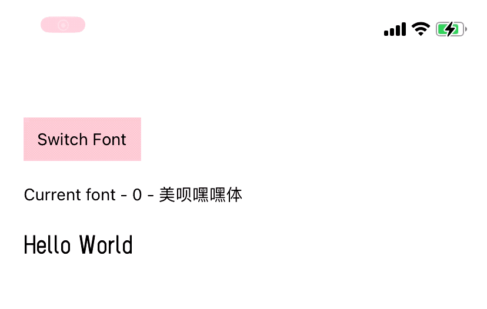
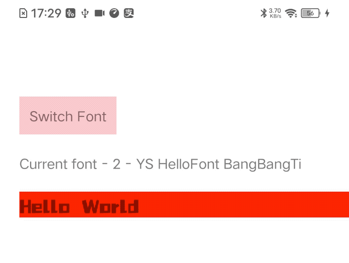

## 示例效果展示
* 切换到新字体，经过loading后，应用上新字体
* 切换到已加载过的字体，直接应用上

iOS


Android



## 使用/Usage
封装后，如下这样使用，解耦的干干净净
```
import { StyleSheet, Text, TouchableOpacity, View } from "react-native";
import React, { useState } from "react";
import ArtText from "./ArtText";

const ArtTextDemo = () => {
  const [fontInfoIndex, setFontInfoIndex] = useState(0);

  return (
    <View style={{ flex: 1, padding:100 }}>
      <TouchableOpacity
        style={{padding:10}}
        onPress={() => { setFontInfoIndex((fontInfoIndex + 1) % fontInfoList.length); }}
      >
        <Text>{"Switch Font"}</Text>
      </TouchableOpacity>
      
      <Text style={{ marginVertical: 20 }}>
        {"Current font - " + fontInfoIndex + " - " + fontInfoList[fontInfoIndex].fontName}
      </Text>

      <ArtText
        text="Hello World"
        style={{ fontSize: 20 }}
        fontInfo={fontInfoList[fontInfoIndex]}
      />
    </View>
  );
};

const fontInfoList = [
  {
    fontName: "美呗嘿嘿体",
    fontUrl: "https://imgcn.cdn.com/app/download/fonts/meibeiheiehiti2.ttf",
  },
  ...
];
```


## 源码/Code

* RN组件 [ArtText.js](media/17016760060792/ArtText.js)
* iOS桥接类 [CustomFontManager.h](media/17016760060792/CustomFontManager.h) [CustomFontManager.m](media/17016760060792/CustomFontManager.m)
* Android桥接类 [WordArtModule.java](media/17016760060792/WordArtModule.java)


### 逻辑解读

#### 1.切换字体背后 会经历什么

判断若是新字体，需要经历如下过程，使字体达到可以应用到Text组件里的状态 

* 字体文件夹不存在则创建
* 下载字体到指定路径
* 通过原生层处理使得字体达到可应用状态

> 若是切换到旧字体会省略其中一些步骤

#### 2.为什么有个「可应用」状态

这是由iOS、安卓原生决定的
* iOS 不仅需要下载到本地就完事了，还需要加载到内存，再设置RN的Text组件的`fontFamily`就不会报错/失效了
* Android 则是需要拿到`Text`组件所对应的原生对象，通过将JS层的`target ID`传到原生去，在原生层去应用字体的

#### 3.其中有哪些需要注意的？
RN应用 所下载的远程字体，不仅应用起来麻烦 需要原生层处理一道，而且在`style`的设置上还要做特别处理规避bug，并且两端还有差异，如下

* iOS，若在字体未达到可应用状态时，提前为Text设置了`fontFamily`，App在debugging时会发生报错。。。

* Android，通过原生去设置远程下载的字体，若再在style里设置fontFamily，竟然会导致字体会应用失效。。。


> BTW：文章开头的示例效果，所对应的Demo 
> [ArtTextDemo](media/17016760060792/ArtTextDemo.js)


