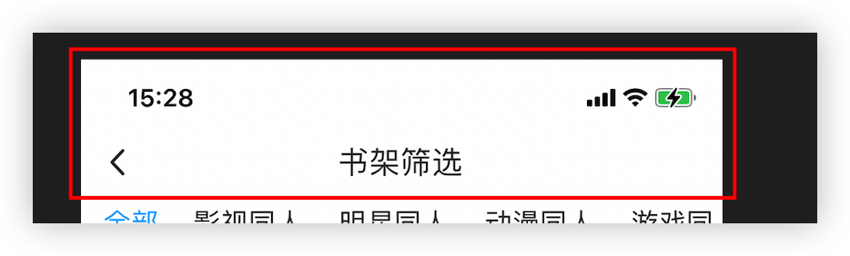
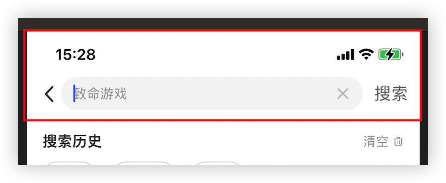
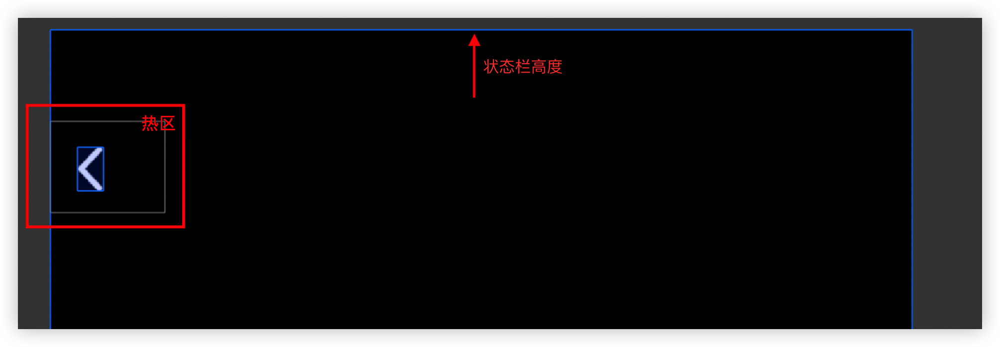

# 瀑布流列表base组件

源码：[BaseList.js](./BaseList.js)

优点：将下拉刷新、上拉加载更多相关的 pageNo逻辑，封装到BaseList中，使用方仅需关注 数据请求的api，让使用方代码量降到最少。

### 使用示例

* 平替 `FlatList`
```javascript
import BaseList from "app/components/list/base";
import { getFanList } from "./service";

const pageSize = 10;

const FanList = (props) => {
  const { userId } = props;
  const _requestFunc = (page, pageSize) => {
    return getFanList({ userId: userId, pageNo: page, pageSize });
  };

  const _renderItem = ({ item, index }) => {
    return <Item {...item} />;
  };

  return (
    // <View style={{ flex: 1 }}>
    <BaseList
      requestFunc={(page) => _requestFunc(page, pageSize)}
      contentContainerStyle={{
        paddingVertical: px2dp(5),
        paddingLeft: px2dp(5),
      }}
      renderItem={_renderItem}
      // numColumns={1}
      uniqueKey={"userId"}
    />
    // </View>
  );
};

```
> 可能会有双列分布不均问题，即某一列大量空白现象

* 最完美（渲染均匀、性能最佳）用法
```javascript
import { StyleSheet, Text, View } from "react-native";
import React, { forwardRef, useCallback, useEffect } from "react";
import ImageTextFeed, {
  sizeForItem as imageTextFeedSizeForItem,
} from "./Feed/ImageTextFeed";
import TextFeed, { sizeForItem as textFeedSizeForItem } from "./Feed/TextFeed";
import { px2dp } from "app/utils/ScreenUtils";
import BaseList from "app/components/list/base";
import SA from "app/utils/SaUtil";

const FeedList = forwardRef((props, ref) => {
  const {
    requestFunc,
    ListHeaderComponent,
    disableAutoLoadNew,
    ListEmptyComponent,
  } = props;

  useEffect(() => {
    console.log("useEffect:FeedList");
  }, []);

  const _renderItem = ({ item, index }) => {
    if (item.previewUri) {
      return <ImageTextFeed item={item} />;
    } else {
      return <TextFeed item={item} />;
    }
  };

  return (
    <BaseList
      ref={ref}
      requestFunc={(page) => requestFunc(page)}
      contentContainerStyle={{
        paddingVertical: px2dp(0),
        paddingLeft: px2dp(12),
      }}
      renderItem={_renderItem}
      numColumns={2}
      uniqueKey={"id"}
      getItemType={(item) => {
        return item.previewUri ? "ImageText" : "Text";
      }}
      headRefreshEnable={true}
      ListHeaderComponent={ListHeaderComponent}
      disableAutoLoadNew={disableAutoLoadNew}
      ListEmptyComponent={ListEmptyComponent}
      sizeForItem={(item, index) => {
        return item.previewUri
          ? imageTextFeedSizeForItem(item)
          : textFeedSizeForItem(item);
      }}
    />
  );
});

export default FeedList;
```


# 图片base组件

源码：[BaseImage.js](./BaseImage.js)

优点： 使用了高性能图片库FastImage，封装为 可配置图片加载失败后展示的占位error图


### 使用示例
```javascript
// aliyun oss image format
// error image url: https://cdn.xxx.com/pic/illustrationstory/default/default_cover_720-1080.png?x-oss-process=image/resize,w_150/quality,q_85/format,webp
// normal image url: https://cdn.xxx.com/pic/illustrationstory/custom/scene/202310/2721/1698415166233-0yZkuCBu9I_960-960.png?x-oss-process=image/resize,w_150/quality,q_85/format,webp

import HBImage from "app/components/image/HBImage";
import { getSize, parseSize } from "app/utils/image/measurer";

const FeedItem = (props) => {

  const coverUrl = useMemo(
    () => getImageUrl(item.coverUrl, imageWidth), //oss resize 拼接url
    [item.coverUrl]
  );

  const imageHeightFromUrl = useMemo(() => {
    return getHeightFromSize(parseSize(coverUrl)); // parseSize 从url(..._720-1080.png...)中解析出宽高 【正常100%都能取出】
  }, [coverUrl]);

  const [imageHeight, setImageHeight] = useState(imageHeightFromUrl);

  useEffect(() => {
    if (!(imageHeightFromUrl > 0)) { 
    //若从url中未能解析出宽高，就通过RN官方Image.getSize方式获取宽高 【正常100%不可能走这里头】
      let h = imageSize;
      getSize(coverUrl)
        .then((size) => {
          if (size) {
            h = getHeightFromSize(size);
          }
          setImageHeight(h);
          kImageHeightCache[coverUrl] = h;
        })
        .catch((err) => {
          setImageHeight(h);
        });
    } else {
      kImageHeightCache[coverUrl] = imageHeightFromUrl;
    }
  }, [coverUrl])
  
  return <>
    {imageHeightFromUrl || imageHeight ? (
        <HBImage
          style={[
            localStyles.image,
            {
              height: imageHeightFromUrl > 0 ? imageHeightFromUrl : imageHeight,
            },
          ]}
          source={{ uri: coverUrl }}
          resizeMode={"contain"}
          errorSource={require("app/components/image/default_cover_720-1080.png")}
        />
      ) : null}
  </>
}

const getHeightFromSize = (size) => {
  if (!(size?.width > 0) || !(size?.height > 0)) return 0;
  return Math.min((imageSize * size.height) / size.width, maxImageHeight);
};
```


# 状态栏导航栏组件

源码：[BaseNavBar.js](./BaseNavBar.js)

优点：  
* 带 返回按钮，点击返回上一页
* 带 title
* 支持自定义导航栏内子视图
* 使用时无需考虑状态栏适配了（内部处理了）

### 使用示例

* 最常规用法 [ `返回键` + `title` ]  
  使用场景：几乎所有页面  
 
  ```javascript
  import BaseNavBar from "app/components/navBar/base";
  <BaseNavBar title={"书架筛选"} />
  ```

* 自定义导航栏内容用法  
  使用场景：导航栏需要特别自定义时  
 
  ```javascript
  import BaseNavBar from "app/components/navBar/base";
  <BaseNavBar>
    {/* 搜索栏 */}
    <View style={styles.inputContainer}>
      <TextInput
        style={styles.textInput}
        placeholder={placeholder || "输入搜索关键字"}
        placeholderTextColor={"#999999"}
        onChangeText={onChangeText}
        value={keyword}
        onSubmitEditing={_onClickSubmit}
        keyboardType="web-search"
        returnKeyType="search"
        autoFocus={true}
      />
      <TouchableOpacity style={styles.closeButton} onPress={clearInput}>
        <Image
          style={styles.closeButtonImage}
          source={require("./images/close-gray.png")}
        />
      </TouchableOpacity>
    </View>
    <TouchableOpacity style={styles.searchButton} onPress={_onClickSubmit}>
      <Text style={{ fontSize: px2dp(16), color: "#666666" }}>搜索</Text>
    </TouchableOpacity>
  </BaseNavBar>
  ```

# 页面左上角的返回按钮组件

源码：[LeftUpBackButton.js](./LeftUpBackButton.js)

优点：  
* 避开了状态栏
* 热区足够大
* 使用起来极简

使用场景：不需要导航栏 但需要返回按钮的页面，e.g. 一些全屏弹窗（图片查看器...）  

### 使用示例



```javascript
import LeftUpBackButton from "app/components/LeftUpBackButton";
<LeftUpBackButton
  //iconType="white"
  //onPress={() => {
    //dismiss alert
  //}}
/>
```


