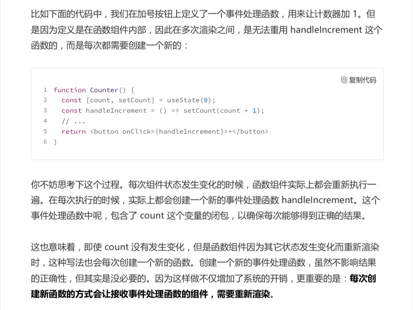
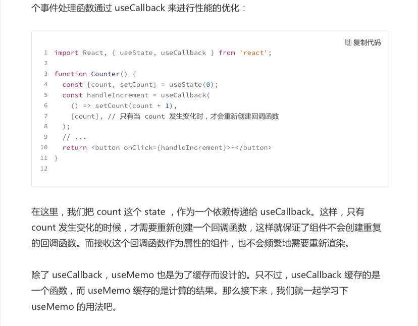
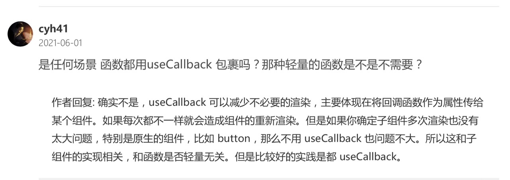
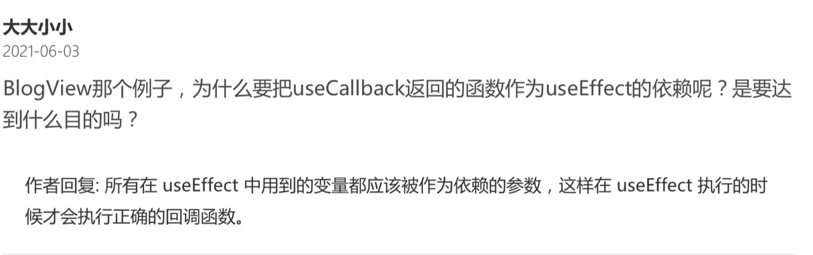
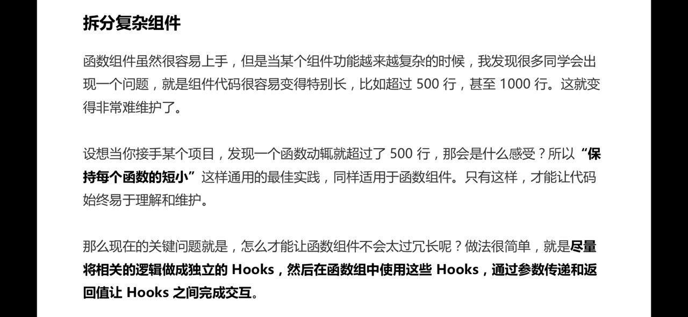
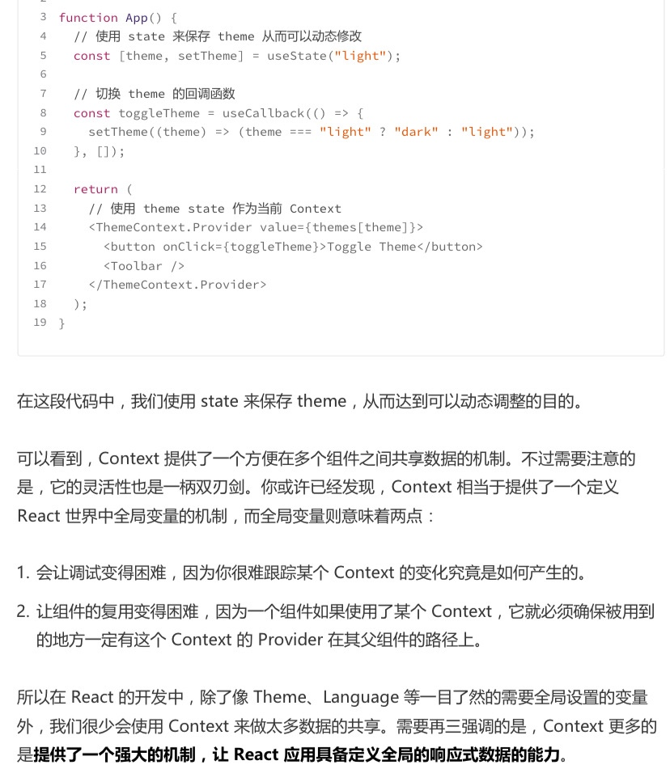
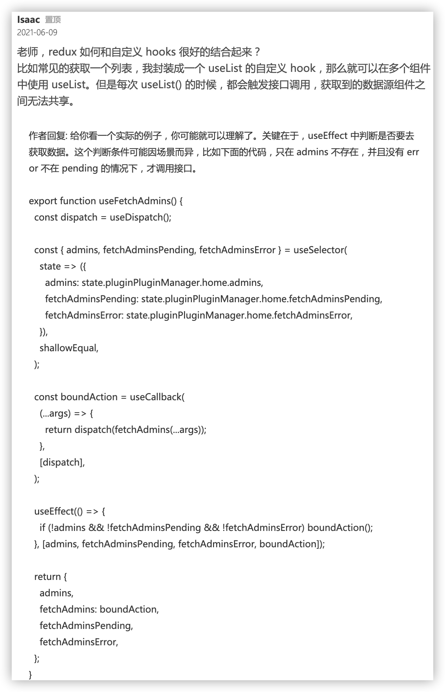
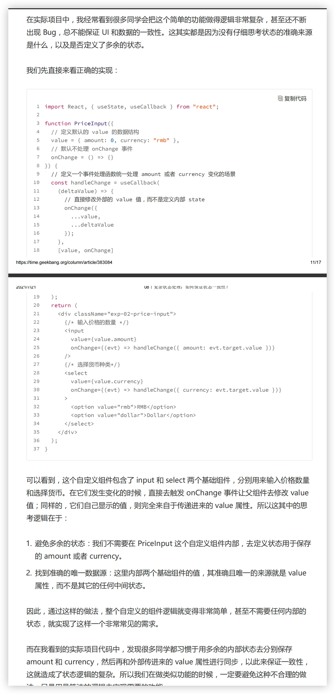
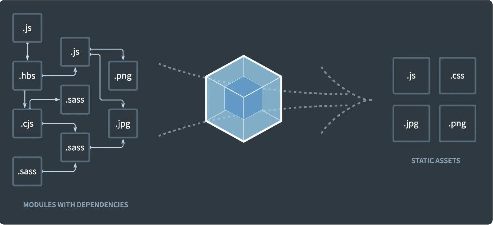

# 《React Hooks 核心原理与实战》学习

## hooks

* Q: 为什么 Facebook 要发明React Hooks？React Hooks 解决了什么问题？

    A: 简化了逻辑重用

    hooks之前，复用逻辑要用到高阶组件或者render props


* 组件每次渲染，内部的函数会重新创建，导致 接收传递函数的子组件 也重新渲染




* useCallback 对组件间传递的 (回调)函数 尽量都包裹






* useMemo 缓存计算


* useCallback，useMemo 只是为了避免 React 组件的重复渲染而导致的性能损失。  

* 而对于原生的节点，比如 div, input 这些，它们已经是原子节点了，不再有子节点， 所以不存在重复刷新带来的性能损失。


* useEffect执行时机是 DOM渲染后


* useEffect中用到的变量，需要作为依赖参数




* 拆分复杂组件：不同逻辑拆到不同的Hooks里




* Context 适用场景：仅 主题色、语言切换




* redux 数据共享 避免不必要的请求




* state 使用注意

state 避免定义多余的，找唯一数据源头 去发起改变



>上次同事libin提到过这个场景：A传参value1给B，B又传value1给C，C里面能触发改变value1 
>
>方案1：C中的操作触发value1变更时，C不维护value1 state，由C回调给B再回调给A，由A改变value1，从而重新渲染B、C  
>
>方案2：C中的操作触发value1变更时，C改变C内部的value1，同时回调给B、A去更新(C外部)对应的value1
>
>根据这篇来看，更倾向于方案1 。避免在子组件定义多余的state(value1)，找唯一数据源头A 去发起改变


## 设计模式
所谓「设计模式」，就是针对特定场景，提供一种公认的最佳实践
* 保证状态的唯一数据源
* 语义化的拆分复杂组件

> Hooks 的一个重要规则，即：Hooks 必须在顶层作用域调用
而不能放在条件判断、循环等语句中，同时也不能在可能的 return 语句之后执行。换句话说，Hooks 必须按顺序被执行到。

* 容器模式，把条件判断的结果放到两个组件之中。可用Hooks替代
```
function CounterRenderProps({ children }) {
...
return children({ count, increment, decrement });
}
```

* render props 模式，重用 UI 逻辑
```
function ListWithMore({ renderItem, data = [], max })
```


## 拆包/分包：提高首屏页面的打开速度
```
function ProfilePage() {
  // 定义一个 state 用于存放需要加载的组件
  const [RealPage, setRealPage] = useState(null);
  // 根据路径动态加载真正的组件实现
  import('./RealProfilePage').then((comp) => {
  setRealPage(Comp);
  });
  // 如果组件未加载则显示 Loading 状态
  if (!RealPage) return 'Loading....';
  // 组件加载成功后则将其渲染到界面
  return <RealPage />
}
```

import() 这个语句完全是由 Webpack 进行处理的  
> Webpack 会将以“./RealProfilePage”模块为起点的所有依赖模块，单独打成一个包。
并且，Webpack 还会生成代码，用于按需加载这个模块。

* react-lodable，实现组件的异步加载  
> 通过高阶组件来实现的，这个高阶组件实现了模块加载、loading 状态以及错误处理的功能。
```
import Loadable from "react-loadable";
// 创建一个显示加载状态的组件
function Loading({ error }) {
  return error ? 'Failed' : 'Loading';
}
// 创建加载器组件
const HelloLazyLoad = Loadable({
  loader: () => import("./RealHelloLazyLoad"),
  loading: Loading,
});
```

* service worker 缓存前端资源：提高第二次以及后续打开 App 的速度

> 可以把 Service Worker 看作一种前端的资源请求代理。Service Worker 会拦截所有浏览器发送出来的请求，你可以通过代码去控制Rest API 这些请求发送到服务器；而 JS、CSS 等静态资源，则通过 Cache Storage 存储
在浏览器端。

## Webpack
> 为主流的前端应用打包工具，它的核心思路是将源代码以及图片、样式文件等资源文件都视为模块，然后通过提供对不同类型资源的处理器，将它们进行统一处理，形成最终可在浏览器运行的代码。



1. 输入输出配置：定义你的应用程序的入口，以及打包结果输出的文件夹位置。
2. 配置对于每一类资源文件的处理器：比如说，对 JavaScript 是用 babel-loader 去编
译；对 less 文件则是用 less-loader 去编译；图片则用 file-loader 去处理。你在项目
中能使用哪些技术或者资源，完全取决于配置了哪些 loader。
3. 插件配置：除了核心的源代码编译和打包流程，Webpack 还支持插件扩展功能，可以
通过插件生成额外的打包结果，或者进行一些其它的处理。比如打包过程生成
index.html，源代码分析报表，提取 CSS 到独立文件，代码压缩，等等。

```
const HtmlWebpackPlugin = require('html-webpack-plugin');
const path = require('path');

module.exports = {
  entry: {
    // 定义ath.resolve(__dirname, './src/app.js'),
  },
  output: {
    // 打包输出的文件名，这里将生成 main.bundle.js
    filename: '[name].bundle.js',
    // 定义打包结果的输出位置
    path: path.resolve(__dirname, 'build'),
  },
  module: {
    // 定义处理源文件的规则，rules 下会按顺序使用匹配的规则
    rules: [
      {
        // 遇到 .js 结尾的文件则使用这个规则
        test: /\.js$/,
        // 忽略 node_modules 目录下的 js 文件
        exclude: /node_modules/,
        use: {
          // 使用 babel-loader 处理 js
          loader: 'babel-loader',
          // babel-loader 的一些选项
          options: {
            presets: ['@babel/preset-env'],
          },
        },
      },
    ],
  },
  plugins: [
    // 使用 HtmlWebpackPlugin 生成一个 index.html，其中自动引入 js
    // 并配置了页面的 title
    new HtmlWebpackPlugin({
      title: 'Webpack Output',
    }),
  ],
};
```

针对这段配置代码，我们一般会把它存储为 webpack.config.js 这样一个文件，这样在我
们的项目下运行 webpack 命令，就会使用这个文件作为配置。

代码中其实已经很直观了，我们不仅定义了输入输出，还配置了 babel-loader，用于编译
JavaScript 文件到兼容主流浏览器的代码。同时，还为 babel-loader 设置了参数

**Less 允许我们通过更强大的机制去写 Css，比如可以定义变量，允许嵌套的规则定义，等等。**  
要让一个 Less 文件最终打包到目标文件中，并被浏览器运行，那么首先需要把 Less
代码转换成 Css，再通过 style 标记插入到浏览器中。

这个过程涉及到三个 loader，如下：
1. less-loader：用于将 Less 代码转换成 Css。
2. css-loader：用于处理 Css 中的 import、url 等语句，以便能分析出图片等静态资源打
包到最终结果。
3. style-loader：会自动生成代码，并将打包后的 Css 插入到页面 style 标签。这个
loader 会将 Css 打包到 js 文件中，在应用运行时，自动生成的代码再把这些 css 应用
到页面上。

```
module.exports = {
  // ...
  module: {
    rules: [
      // ...
      {
        // 检测 less 文件
        test: /\.less$/,
        // 使用了三个 loader，注意执行顺序是数组的倒序
        // 也就是先执行 less-loader
        use: ['style-loader', 'css-loader', 'less-loader'],
      },
    ],
  },
  //...
};
```

如果项目要支持 sass 作为 Css 预处理器，那么顺序就是 sass-loader -> css-
loader -> style-loader。可以看到，我们只要替换 less-loader 为 sass-loader，后两个
loader 是完全一样的。

**常见QA**

* 为什么 CSS 代码会进入到 JavaScript 文件中呢？最终它是怎么应用到页面的呢？  

    其实背后的过程主要是，生成的 CSS 代码会以字符串的形式作为一个模块打包
到最终结果，然后在运行时由 style-loader 提供的一个函数 injectStylesIntoStyleTag ，
来将这个模块加入到页面的 style 标签中，从而最终生效。

* 如果我们想让生成的 CSS 文件和 JavaScript 文件分开，应该如何做呢？
    
    从 rules 中去掉 style-loader 这个配置，以避免 CSS 进入到 JavaScript 文件中。
实现提取 CSS 模块到单独 CSS 文件的 plugin 是 mini-css-extract-plugin

* plugin 和 loader 的区别
    * loader主要用于处理不同类型的资源，将它们转换成模块；
    * plugin 通常用于生成一些除了JavaScript bundle 之外的一些打包结果，比如例子中的 index.html 和 css 文件

* React Native中用到 babel的例子


*  Webpack 动态加载模块


## 感谢 

* 感谢公司购买了这个课程《React Hooks 核心原理与实战》

* 感谢《React Hooks 核心原理与实战》作者分享这些经验


