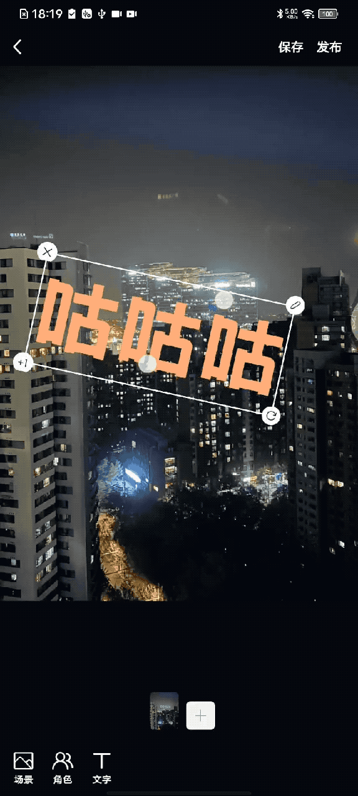

## 需求
仿抖音、小红书，图片视频编辑区，贴图、贴文字功能  
* **View支持拖拽**
* View右下角有一个icon比较特殊，该icon可控制View缩放
    * icon随手指移动 
    * View缩放（以View中心点为圆心）  
    * View会旋转（以View为中心点为圆心）  
    * icon位置一直保持在View右下角  
* View支持双指捏 进行缩放

效果图

## 源码
* [HBMultiGestureView.js](./HBMultiGestureView.js)  
* [calculator.js](./calculator.js) 
* [CornerToolGestureView.js](./CornerToolGestureView.js)

### 解读 [HBMultiGestureView.js](./HBMultiGestureView.js)  

* 使用的什么手势api？  

通过`PanResponder`为`Animted.View`添加手势

* 将不同的手势操作 处理为拖拽、旋转、缩放等UI表现，从哪着手？  

通过手势回调`onPanResponderGrant`、`onPanResponderMove`、`onPanResponderRelease`去

* 如何判断 确定是否操作的右下角特殊icon视图？  

右下角icon `onLoad`后，拿到`target`，通过入参`rotateScaleTargetRef`传递给`HBMultiGestureView`，`HBMultiGestureView`内 通过手势回调参数中的`e.nativeEvent.target`获取所操作的视图target，比较判断是否相等

### 解读 [calculator.js](./calculator.js) 

里面都是公式函数，用在[HBMultiGestureView.js](./HBMultiGestureView.js) 中，处理这些核心计算：

* 计算两指连成的直线移动后的 角度， 从而确定 双指操作时的**旋转角度**

* 计算两指移动后与移动前相比 两指连线的倍数关系， 从而确定 双指操作时的**放大倍数**

* 计算A点、初始触摸位置B点、当前触摸位置C点，计算AC/AB放大比例， 从而确定单指拖动右下角按钮时的**放大倍数**  
> 注：A点，即触摸开始时 视图的中心位置

* 计算向量AC与AB的夹角， 从而确定单指拖动右下角按钮时的**旋转角度**

### 解读 [CornerToolGestureView.js](./CornerToolGestureView.js)

* `CornerToolGestureView`，是四个角落携带工具按钮的手势视图 

* 基于`HBMultiGestureView`封装的，所以开发时真正用的是这个`CornerToolGestureView`  

> `HBMultiGestureView`就类似一个三方库，不是面向具体业务的，俗话说就是，开发时直接用它去组装UI 不够简单，于是封装为更好用的组件`CornerToolGestureView`，用于各个地方。
> 
> 就像是react-native-fast-image，我们并不在开发功能时直接用它，往往会对这个三方组件封装一层(e.g.增加了设置error占位图能力)，再去用于各个地方，比如 我们封装的[图片base组件](../base-components/#图片base组件)

