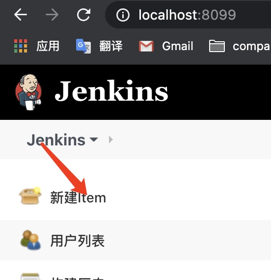
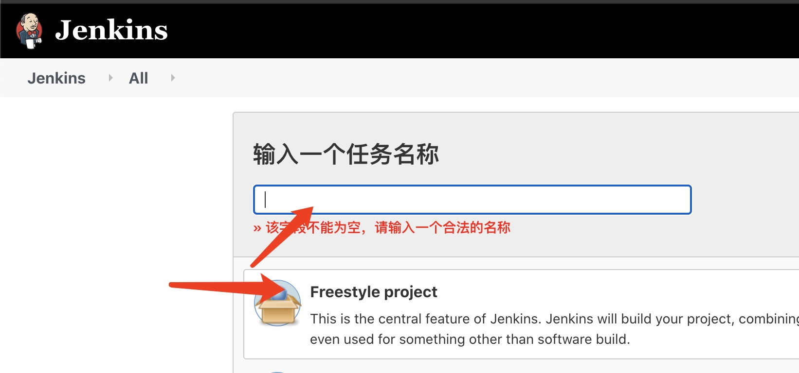
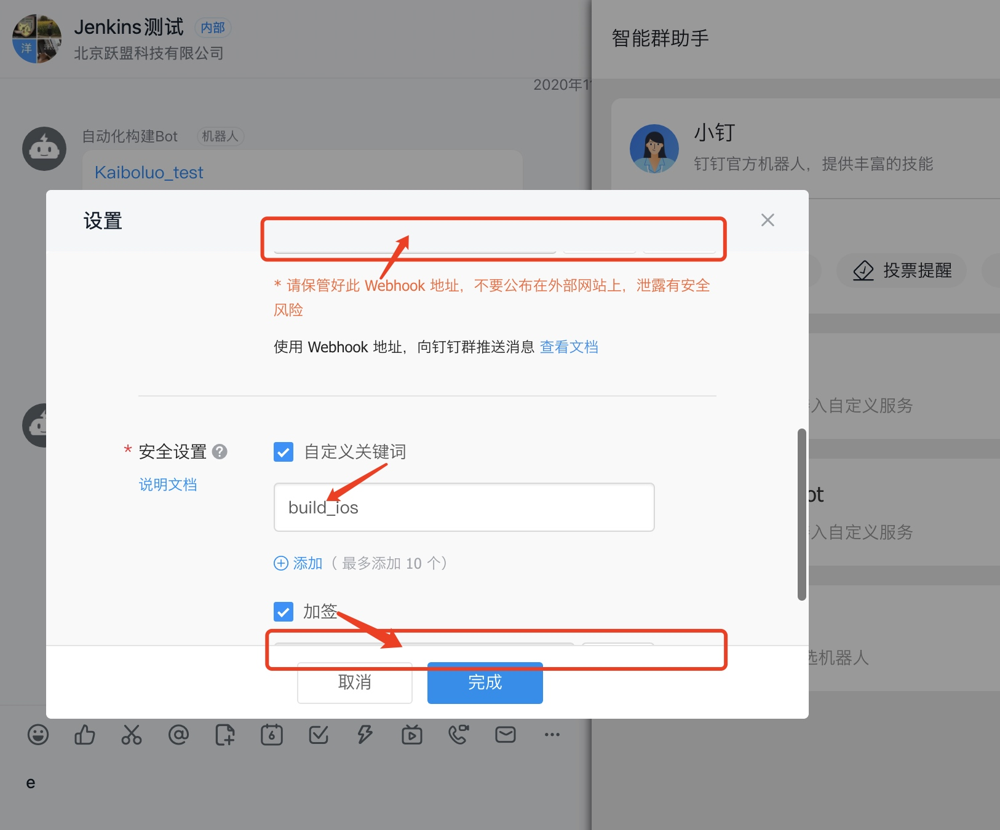
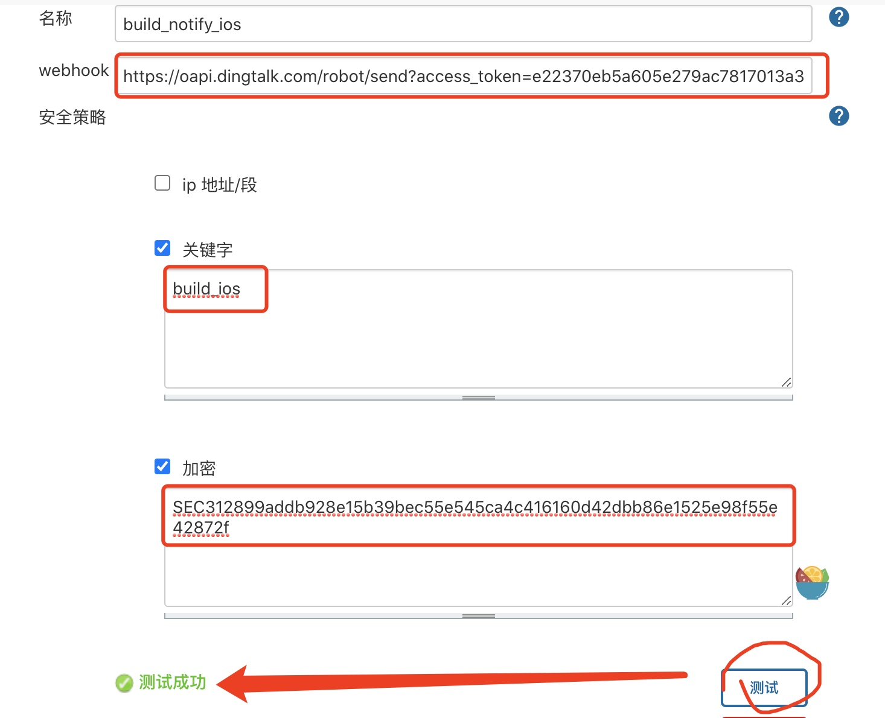
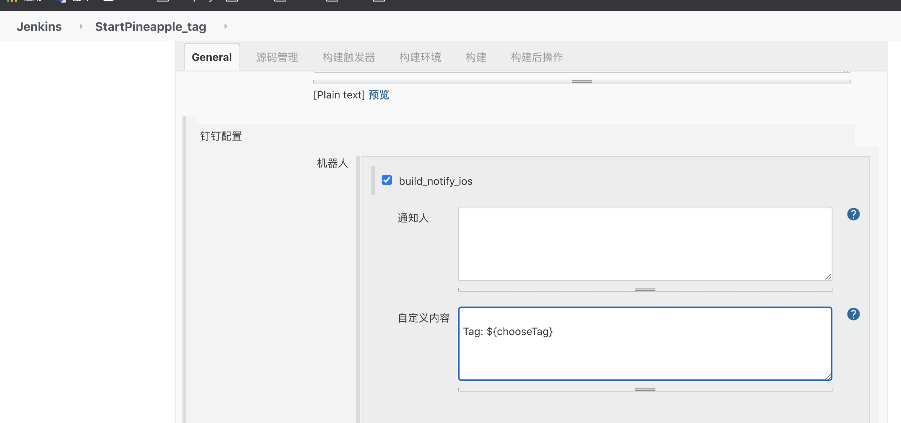
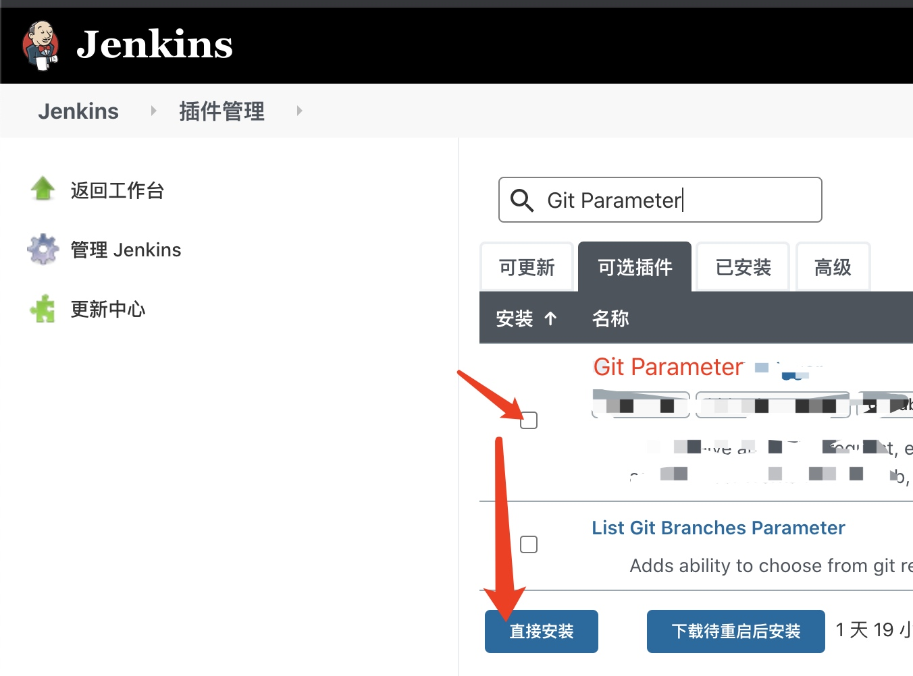
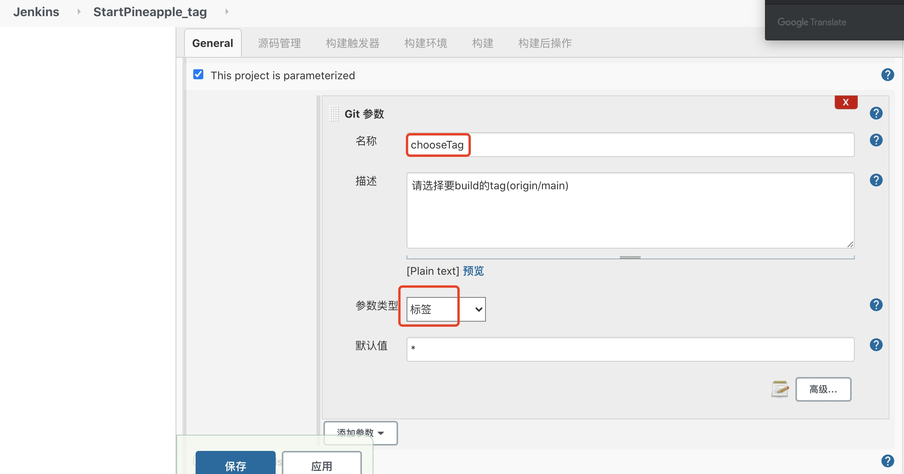
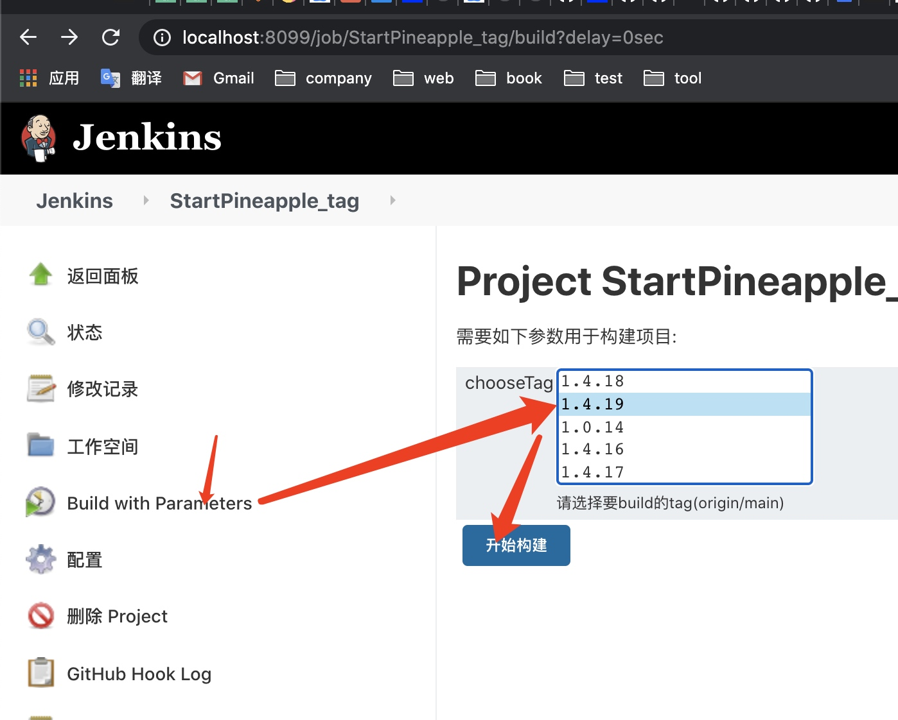
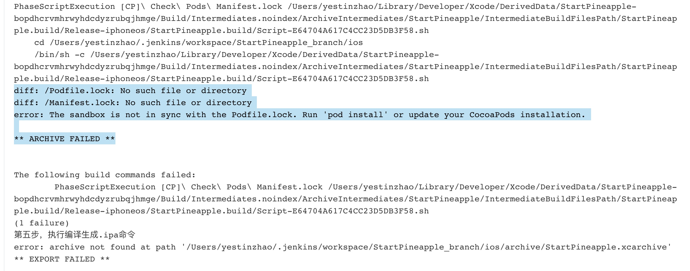
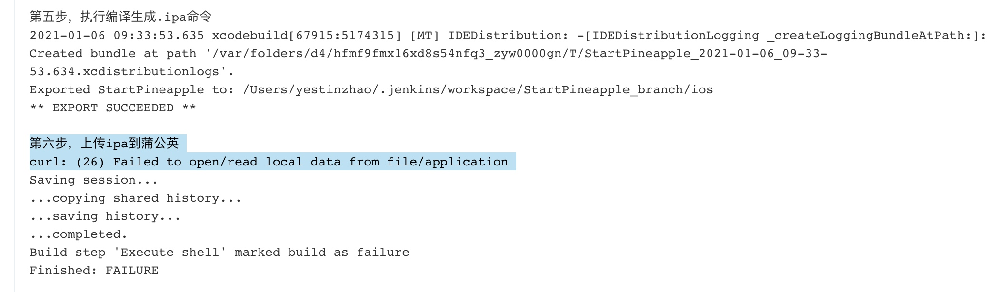

# Jenkins for iOS（第二次搭建记录）

## 运行环境搭建（简略版）
* 下载 jenkins.war jdk8
* 运行jenkins

首次设置账户信息（备忘）
账户: admin 
密码: admin


## 建Job & 配置
#### 建第一个Job



#### 设置Git
* 添加git 地址
* 添加ssh凭据【注意】
    1. 账号：生成ssh时的邮箱(~/.ssh/id_rsa.pub 最末尾可见）
    2. 密码：ssh秘钥（取于 ~/.ssh/id_rsa）

#### 配置 脚本

```
#!/bin/bash -il

echo 'Hi, start building ...'

pwd
whoami

export LANG=en_US.UTF-8

export LANGUAGE=en_US.UTF-8

export LC_ALL=en_US.UTF-8

#工程环境路径
workspace_path=.

#项目名称
project_name=myApp

#ipa 所存放的文件夹
ipaPath="ipa"

echo "第一步，更新库文件"

yarn

cd ios

/usr/local/bin/pod install --verbose --no-repo-update


echo "第二步，清除缓存文件...................."
xcodebuild clean
rm -rf archive
rm -f $ipaPath/$project_name.ipa


echo "第三步，设置打包环境，准备开始打ipa包...................."
#sed -i '' 's/\app-store\<\/string\>/\ad-hoc\<\/string\>/' archieveOpt.plist
#sed -i '' 's/ProvisioningStyle = Automatic;/ProvisioningStyle = Manual;/' $project_name.xcodeproj/project.pbxproj


echo "第四步，执行编译生成.app命令"
#解决main.jsbundle找不到的问题
yarn build:ios

xcodebuild archive -workspace $project_name.xcworkspace -scheme $project_name -configuration Release -archivePath archive/$project_name.xcarchive #CODE_SIGN_IDENTITY="iPhone Distribution: Beijing Maihuo Technology Co., Ltd. (HFNWKQ65UU)" PROVISIONING_PROFILE_SPECIFIER="093cc99a-e0ce-47fb-a14d-ba1a0f5a290d.mobileprovision"


echo "第五步，执行编译生成.ipa命令"
xcodebuild -exportArchive -exportOptionsPlist archieveOpt.plist -archivePath archive/$project_name.xcarchive -exportPath $ipaPath -configuration Release

#改名 “我的应用.ipa” 为 "myApp.ipa"
mv ${ipaPath}/*.ipa ${ipaPath}/${project_name}.ipa


echo "第六步，上传ipa到蒲公英"
curl -F "file=@${ipaPath}/${project_name}.ipa" -F "uKey=get_uKey_from_pgyer" -F "_api_key=get_api_key_from_pgyer" https://www.pgyer.com/apiv1/app/upload
```
其中，脚本的最后部分是 上传蒲公英。参照蒲公英官网教程获取 get_uKey_from_pgyer，get_api_key_from_pgyer 去吧。

> 到这里就可以结束了。当然，如果定制更多功能，优化流程，可以继续看下去。

#### 配置 钉钉通知
>参考: [Jenkins配置钉钉通知](https://www.zyxiao.com/p/46030)  



按照👆钉钉群里机器人的设置，挨个配置到jenkins的钉钉通知插件里👇


然后，对某个Job添加 钉钉通知👇



#### 配置 build前选择tag

安装 `Git Parameter`插件


然后往Job里设置 


---- 
最后，可以愉快的使用了，简单傻瓜式点击，即可实现 拉取对应tag代码、打包、上传到蒲公英，并且通知到钉钉群了。



## 错误记录

#### Q：两个Job首次在jenkins执行build，均出现 打包失败

```
diff: /Podfile.lock: No such file or directory
diff: /Manifest.lock: No such file or directory
error: The sandbox is not in sync with the Podfile.lock. Run 'pod install' or update your CocoaPods installation.

** ARCHIVE FAILED **
```

R: 通过ios/Pods/ 可以发现，三方库不全。往往需要多试几次，才能集成完。
A: 第二次执行build，就ok了


#### Q：上传蒲公英失败

```
curl: (26) Failed to open/read local data from file/application
```

Action: 
去 `/用户/yestin/.jenkins/workspace`目录下，发现`ios/`下的ipa文件名是 `我的应用.ipa`，并不是`myApp.ipa`，莫非是这个影响？

果然就是。因为`xcodebuild -exportArchive`不支持直接对ipa包命名，可能要结合Xcode某个设置。

A: 先找简单方法解决吧👇，命令 更改文件名
```
#改名 “我的应用.ipa” 为 "myApp.ipa"
mv ${ipaPath}/*.ipa ${ipaPath}/${project_name}.ipa

echo "第六步，上传ipa到蒲公英"
curl -F "file=@${ipaPath}/${project_name}.ipa" -F "uKey=e2ff6a115f6763483e2559741d20e06f" -F "_api_key=3352a89fc193379c982ae1ad51444103" https://www.pgyer.com/apiv1/app/upload
```


## 其它
[这哥们](https://www.jianshu.com/p/004384b56d0f) 提供了较详细的脚本，要做的更复杂可以参考下~


