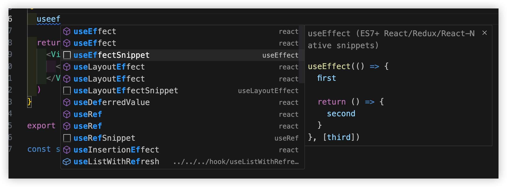
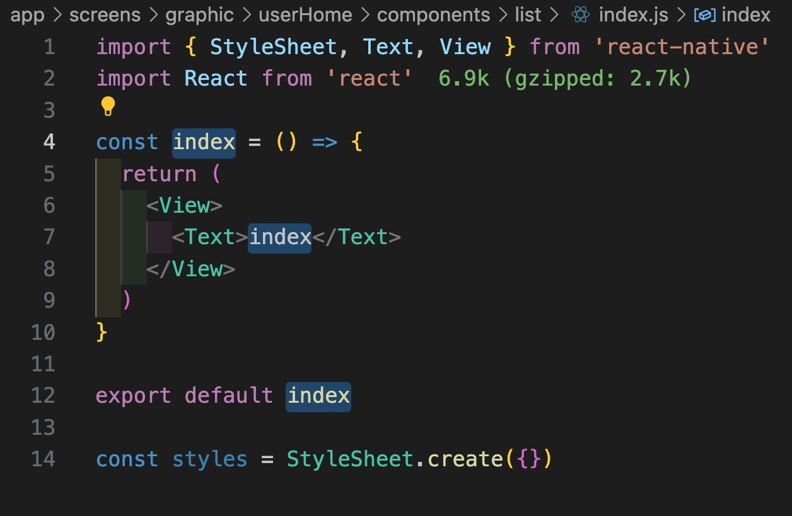
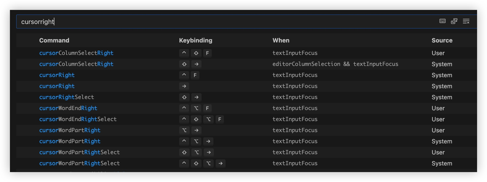
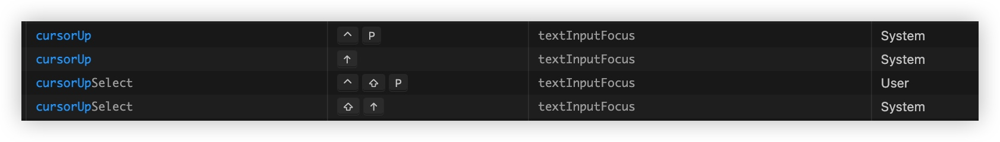
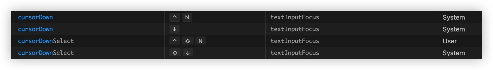
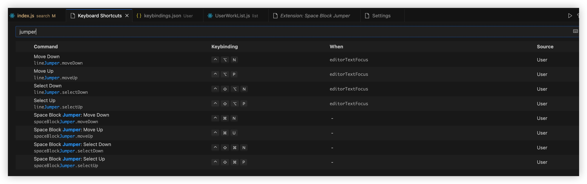




## 插件

* 代码智能提示
copilot  
触发内联建议 Option (⌥)+\
> https://docs.github.com/zh/copilot/configuring-github-copilot/configuring-github-copilot-in-your-environment?tool=vscode#keyboard-shortcuts-for-macos

* (键联提示)代码片段
    * ES7+ React/Redux/React-Native snippets
    * massCode assistant (配合打开massCode App使用)

* 标签修改 自动首尾同步
Auto Rename Tag

* 拼写检测
Code Spell Checker

* 格式化
prettier

* 提升阅读感受
    * Gitlens 悬停查看代码改动人
    * Material Icon Theme / vscode-icons 侧边导航区 目录展示icon
    * indent-rainbow 标签开闭连线
    * Image Preview 在图片路径引用行 左侧展示icon


## code snippets

[React/Redux/React-Native snippets](https://marketplace.visualstudio.com/items?itemName=dsznajder.es7-react-js-snippets)

指令说明：  
https://github.com/ults-io/vscode-react-javascript-snippets/blob/HEAD/docs/Snippets.md

优点：  
* 对常用的hooks支持的简直完美  
可以试试输入`useeff...`。
会提示`useEffectSnippet`，enter后挨个填词，tab切换光标，<u>**set方法自动驼峰**</u>，简直完美！



* 使用`rnfes`创建组件，会根据文件名 命名组件



> 想根据英文记忆一下快捷指令名称，可以参考 
[Fullstack React/React Native snippets](https://marketplace.visualstudio.com/items?itemName=walter-ribeiro.full-react-snippets)  
对快捷指令 都有英文解释


## Mac、VSC快捷键

### Mac
系统自带
* (shift+) ctrl+ (option+) f/b
* (shift+) ctrl+ p/n

> VSC 更改了上述快捷键对应的指令，非常糟糕。可以调整下如下






### VSC

* Next Change  （**Important**）


* terminal、editor互切
    * focus到终端: `cmd+j`
    * focus到editor: 
        * `(ctrl+)shift+tab`
        * `cmd+1`


* 光标移动到函数头尾、标签头尾
    * `cmd+shift+\`: 跳转至`{` `}`、跳转至`<` `>`


* 选中 括号内代码

支持不断 扩张/收缩 选中 
```
  {
    "key": "ctrl+s",
    "command": "editor.action.smartSelect.expand",
    "when": "editorTextFocus"
  },
  {
    "key": "ctrl+shift+s",
    "command": "editor.action.smartSelect.shrink",
    "when": "editorTextFocus"
  },
```


* 光标移动多行
    * 插件line-jumper  
    配成`(shift+)ctrl+option+p/n`
    
    * 插件Space Block Jumper  
    跳转到临近的空行(选中)
    > 居然无法设置 这几个键组合`ctrl+cmd+p`
    



* Next Problem
    * cmd+(shift+)'  
>常用于写代码时要import，故意写error，然后在顶部import结束后，再快速跳回error处继续写代码


* 导航区(explorer view)定位当前编辑文件
```
  {
    "key": "shift+cmd+j",
    "command": "workbench.files.action.showActiveFileInExplorer",
    "when": "editorFocus"
  }
```


* 其它更改VSCode的自定义快捷键  
更新于 2023.07.26 [keybindings](media/16878480327198/keybindings.json)
> 这是一份我常用的、好用的VSC自定义快捷键备份。
>
> 为什么要改？  
> 因为，当Mac的快捷键与VSC冲突时，当好用的插件快捷键与VSC冲突时，当VSC自带的快捷键失灵时，一般就需要更改VSC的 `keybindings.json`文件了


