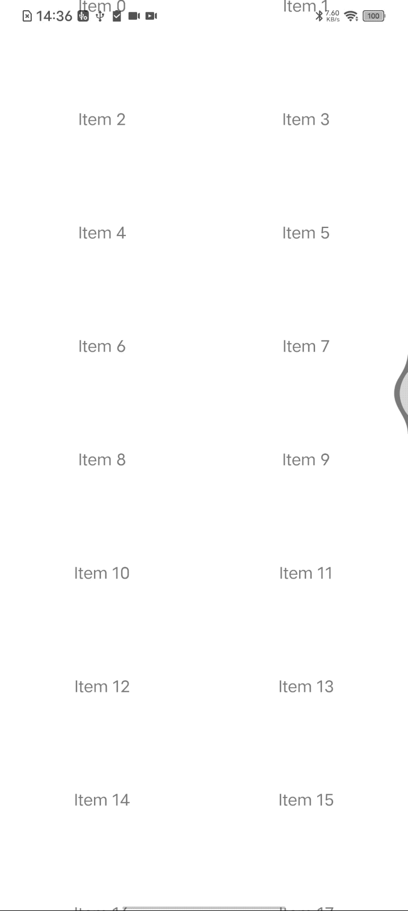

ScrollView滚动动画，实现起来就很容易
<details><summary> 源码 展开查看</summary>

```
import React, { useRef, useEffect } from "react";
import { ScrollView, Text, View, Animated, Easing } from "react-native";

/**
 * ScrollView自动滚动了！
 */
const AutoScrollScrollView = () => {
  const scrollViewRef = useRef();
  const scrollY = useRef(new Animated.Value(0)).current;

  const contentHeight = 1000; // 你的内容高度
  const scrollDuration = 5000; // 滚动动画的持续时间（毫秒）

  useEffect(() => {
    const startScrollAnimation = () => {
      Animated.timing(scrollY, {
        toValue: contentHeight,
        duration: scrollDuration,
        easing: Easing.linear,
        useNativeDriver: false,
      }).start(() => {
        // 滚动到顶部并重新开始动画
        scrollY.setValue(0);
        startScrollAnimation();
      });
    };

    startScrollAnimation();
  }, []);

  return (
    <ScrollView
      ref={scrollViewRef}
      contentContainerStyle={{ height: contentHeight }}
      onScroll={(event) => {
        const offsetY = event.nativeEvent.contentOffset.y;
        // 可以在滚动时执行一些其他操作
      }}
      scrollEventThrottle={16}
    >
      <Animated.View
        style={{
          height: contentHeight,
          transform: [{ translateY: scrollY }],
        }}
      >
        <Text>Scrolling Content</Text>
        {/* 这里可以放置你的滚动内容 */}
      </Animated.View>
    </ScrollView>
  );
};

export default AutoScrollScrollView;
```
</details>

然而，FlatList 、flashList、masonryFlashList要实现自动滚动动画， 却用不了`ScrollView`同样的方式，实现起来就很曲折，经过各种尝试均失败，无奈，使用定时器方式实现了，

效果图：  



源码如下
```
import React, { useRef, useEffect, useState } from "react";
import { FlatList, View, Text } from "react-native";
import { MasonryFlashList } from "@shopify/flash-list";

const data = Array.from({ length: 20 }, (_, index) => ({
  key: index.toString(),
  text: `Item ${index}`,
}));

const renderItem = ({ item }) => (
  <View
    style={{
      height: 100,
      justifyContent: "center",
      alignItems: "center",
    }}
  >
    <Text>{item.text}</Text>
  </View>
);

const SlowScrollFlatList = ({ duration }) => {
  const flatListRef = useRef();
  const scrollDistance = 2; // 控制每次滚动的距离
  const scrollInterval = 20; // 每次滚动之间的间隔时间（毫秒）
  const [isDragging, setIsDragging] = useState(false);

  const scrollIntervalId = useRef(null);
  const currentScrollDistance = useRef(0);

  const totalScrollDistance = 100 * (data.length - 1);

  const scroll = () => {
    if (currentScrollDistance.current < totalScrollDistance && !isDragging) {
      const nextDistance = Math.min(
        totalScrollDistance,
        currentScrollDistance.current + scrollDistance
      );
      flatListRef.current.scrollToOffset({
        offset: nextDistance,
        animated: false,
      });
      currentScrollDistance.current = nextDistance;
    }
  };

  const startAutoScroll = () => {
    scrollIntervalId.current = setInterval(scroll, scrollInterval);
  };

  // 监听FlatList的滚动位置
  const onScroll = (event) => {
    currentScrollDistance.current = event.nativeEvent.contentOffset.y;
  };

  useEffect(() => {
    const stopAutoScroll = () => {
      clearInterval(scrollIntervalId.current);
    };

    flatListRef.current.scrollToOffset({
      offset: currentScrollDistance.current,
      animated: false,
    });

    startAutoScroll(); // 初始启动自动滚动

    return () => {
      stopAutoScroll();
    };
  }, [isDragging]);

  return (
    // <FlatList
    //   ref={flatListRef}
    //   data={data}
    //   renderItem={renderItem}
    //   keyExtractor={(item) => item.key}
    //   onScrollBeginDrag={() => setIsDragging(true)}
    //   onScrollEndDrag={() => {
    //     setIsDragging(false);
    //     startAutoScroll(); // 用户停止拖动后，重新启动自动滚动
    //   }}
    //   onScroll={onScroll}
    //   // 设置其他 FlatList 的属性
    // />

    <MasonryFlashList
      ref={flatListRef}
      estimatedItemSize={/* itemStyles.container.height */ 100}
      data={data}
      keyExtractor={(item, index) => item?.key}
      initialNumToRender={5}
      numColumns={2}
      renderItem={renderItem}
      showsVerticalScrollIndicator={false}
      onScrollBeginDrag={() => setIsDragging(true)}
      onScrollEndDrag={() => {
        setIsDragging(false);
        startAutoScroll(); // 用户停止拖动后，重新启动自动滚动
      }}
      onScroll={onScroll}
    />
  );
};

export default SlowScrollFlatList;
```

**核心逻辑**：  

每间隔 `scrollInterval` ms，滚动 `scrollDistance` 小步距离  

当 `scrollInterval`足够小，在`1/60`s 即16ms左右时，就类似于流畅的每秒60帧动画了  

根据实际的效果，调节`scrollInterval` 、`scrollDistance` 大小，使达到满意的效果
