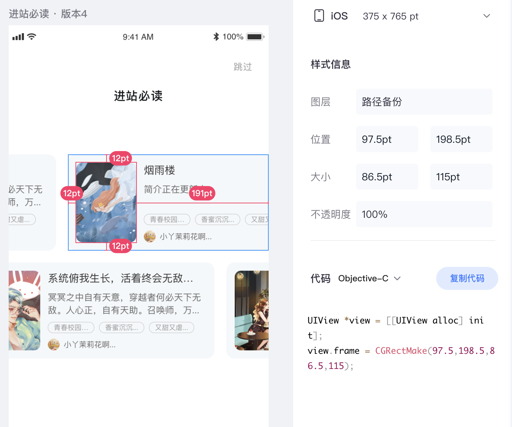

## 需求  



效果展示


## 源码
```
import { StyleSheet, Text, TouchableOpacity, View } from "react-native";
import React, { useEffect, useRef, useState } from "react";
import HBImage from "../../../../components/image/HBImage";
import { px2dp } from "../../../../utils/ScreenUtils";
import { MasonryFlashList } from "@shopify/flash-list";
import { bookOpenChoices } from "app/service/MarkService";
import * as indexUtil from "app/utils/index";

const itemWidth = px2dp(12 + 86.5 + 251.5);
const itemHeight = px2dp(139);
const itemSpace = px2dp(17);

const UserChooseBook = (props) => {
  const { selectedSex, marks } = props;

  const [dataList, setDataList] = useState([]);

  const listViewRef = useRef(null);

  const { onScrollBeginDrag, onScroll } = useListViewAutoScrollAnimate({
    listViewRef: listViewRef,
    framesPerSecond: 40, // 1000/40 = 25帧/秒
    offsetPerFrame: 1,
    totalScrollDistance:
      (itemWidth * Math.max(0, Math.max(0, dataList?.length || 0) - 1)) / 2,
    disableAnimate: false,
  });

  useEffect(() => {
    bookOpenChoices({
      gender: selectedSex || "girl",
      ...(marks ? { marks: marks } : {}),
    }).then((res) => {
      setDataList(res.books);
    });
  }, []);

  const renderItem = (props) => {
    console.log("renderItem props:", props);
    return (
      <BookItem
        key={props.item?.bookId}
        {...props}
        onPress={() => {
          goNext(props.item.bookId);
        }}
      />
    );
  };

  const goNext = (bookId) => {};

  return (
    <View style={styles.container}>
      <Text style={styles.title}>进站必读</Text>
      <View style={styles.scrollContainer}>
        <MasonryFlashList
          ref={listViewRef}
          estimatedItemSize={/* itemStyles.container.height */ 100}
          data={dataList}
          keyExtractor={(item, index) => item?.["bookId"]}
          initialNumToRender={5}
          numColumns={2}
          renderItem={renderItem}
          showsVerticalScrollIndicator={false}
          onScrollBeginDrag={onScrollBeginDrag}
          onScroll={onScroll}
        />
      </View>
      <TouchableOpacity style={styles.button} onPress={() => goNext()}>
        <Text style={styles.buttonTitle}>{"跳过"}</Text>
      </TouchableOpacity>
    </View>
  );
};

const styles = StyleSheet.create({
  container: {
    flex: 1,
    alignItems: "center",
    paddingLeft: itemSpace,
  },
  title: {
    marginTop: px2dp(90),
    color: "#101417",
    fontWeight: "bold",
    fontSize: px2dp(17),
    lineHeight: px2dp(24),
  },
  scrollContainer: {
    marginTop: px2dp(72),
    width: itemHeight * 2 + itemSpace * 2, //px2dp(139 * 2 + 17),
    height: px2dp(375),
    transform: [{ rotate: "270deg" }],
  },
});


export default UserChooseBook;

// -----  -----  -----  ----- hooks  -----  -----  -----  -----

const useListViewAutoScrollAnimate = ({
  listViewRef,
  framesPerSecond,
  offsetPerFrame,
  totalScrollDistance,
}) => {
  const scrollInterval = Math.floor(1000 / framesPerSecond); // 每次滚动之间的间隔，每秒动画的帧数
  const scrollDistance = offsetPerFrame; // 控制每scrollInterval 滚动的距离

  const [disabled, setDisabled] = useState(false);

  const scrollIntervalId = useRef(null);

  const currentScrollDistance = useRef(0);

  useEffect(() => {
    const stopAutoScroll = () => {
      clearInterval(scrollIntervalId.current);
    };

    if (totalScrollDistance > 10 && !disabled) {
      setTimeout(() => {
        startAutoScroll();
      }, 100);
    }

    return () => {
      stopAutoScroll();
    };
  }, [totalScrollDistance, disabled]);

  const scroll = () => {
    const nextDistance = Math.min(
      totalScrollDistance,
      currentScrollDistance.current + scrollDistance
    );
    listViewRef.current.scrollToOffset({
      offset: nextDistance,
      animated: false,
    });

    currentScrollDistance.current = nextDistance;
    if (currentScrollDistance.current >= totalScrollDistance) {
      currentScrollDistance.current = 0;
    }
  };

  const startAutoScroll = () => {
    scrollIntervalId.current = setInterval(scroll, scrollInterval);
  };

  const onScrollBeginDrag = () => {
    setDisabled(true);
  };

  const onScroll = (e) => {
    currentScrollDistance.current = e.nativeEvent.contentOffset.y;
  };

  return {
    onScrollBeginDrag,
    onScroll,
  };
};

// -----  -----  -----  ----- component  -----  -----  -----  -----

const BookItem = (props) => {
  const { item, index, onPress } = props;
  const { coverUrl, bookName: title } = item;

  const _coverUrl = indexUtil.getImageUrl(
    indexUtil.DOMAIN_PICAPP,
    coverUrl,
    indexUtil.IMG_BOOK_COVER_LIST
  );
  return (
    <TouchableOpacity
      style={[itemStyles.container, index == 1 ? { marginTop: 100 } : {}]}
      onPress={onPress}
    >
      <View style={itemStyles.transformContainer}>
        <HBImage source={{ uri: _coverUrl }} style={itemStyles.cover} />
        <View style={itemStyles.infoContainer}>
          <Text style={itemStyles.title} numberOfLines={1}>
            {title}
          </Text>
        </View>
      </View>
    </TouchableOpacity>
  );
};

const itemStyles = StyleSheet.create({
  container: {
    height: itemWidth,
    width: itemHeight,
    borderRadius: px2dp(12),
    overflow: "hidden",
    backgroundColor: "#F4F8FA",
    marginBottom: itemSpace,
  },
  transformContainer: {
    width: itemWidth,
    height: itemHeight,
    transform: [
      { rotate: "90deg" },
      { translateX: (itemWidth - itemHeight) / 2 },
      { translateY: (itemWidth - itemHeight) / 2 },
    ],
    flexDirection: "row",
    alignItems: "center",
  },
  cover: {
    width: px2dp(86),
    height: px2dp(115),
    marginLeft: px2dp(12),
    borderRadius: px2dp(10),
  },

  infoContainer: {
    marginLeft: px2dp(11),
    flex: 1,
    height: px2dp(115),
  },
  title: {
    fontSize: px2dp(15),
    lineHeight: px2dp(21),
    color: "#000",
    paddingRight: px2dp(10),
  },
});
```


### 代码核心逻辑 

1. MasonryFlashList 自动慢速滚动动画，借鉴 这一篇[瀑布流列表 自动滚动动画](../waterfall-list-autoscroll/)，在这里运用时 封装在`useListViewAutoScrollAnimate`之中

2. **把列表变成水平滑动的方式是，将列表旋转90度，将Item内容反转90度。**

> 为何不使用类似`ScrollView`的`horizontal`属性，直接设成水平滚动不就好了？  
我也想，只不过[MasonryFlashList官方](https://shopify.github.io/flash-list/docs/guides/masonry#unsupported-props)明确表示，不支持呀~ 


#### 以下是列表垂直变水平的关键步骤
```
const itemWidth = px2dp(12 + 86.5 + 251.5);  //大值
const itemHeight = px2dp(139);               //小值
const itemSpace = px2dp(17);
```

* Item内容，按蓝湖图设置真实宽高
```
transformContainer: {
    width: itemWidth,  //大
    height: itemHeight //小
}
```

* Item 要被颠倒90度，展示在一个垂直列表里，所以`transform`这样设置
```
transform: [
      { rotate: "90deg" },
      { translateX: (itemWidth - itemHeight) / 2 },
      { translateY: (itemWidth - itemHeight) / 2 },
    ]
```

* 在这个垂直列表里，每个Item的壳容器 宽高是这样的
```
container: {
    height: itemWidth, //大
    width: itemHeight, //小
}
```

* 把垂直的列表变成 水平列表，那么对列表反向旋转90度，即这样设
```
scrollContainer: {
    width: itemHeight * 2 + itemSpace * 2, //px2dp(139 * 2 + 17),
    height: px2dp(375),
    transform: [{ rotate: "270deg" }],
  },
```

