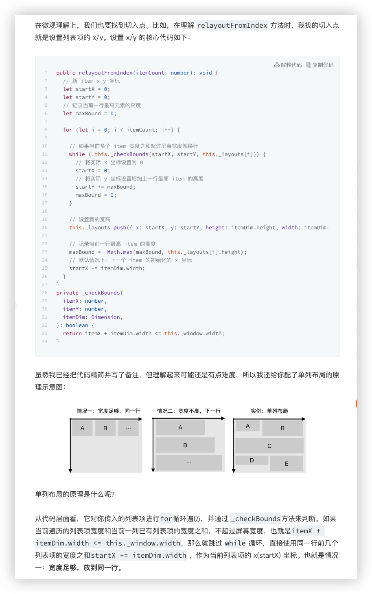
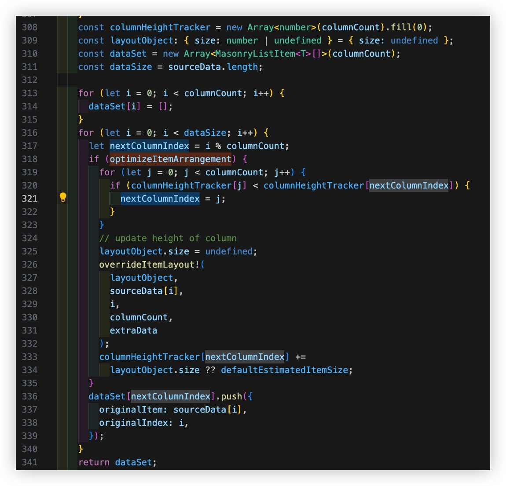

# MasonryFlashList 瀑布流布局列高不均 解决方案

瀑布流布局列高不均 [演示效果](https://github.com/Shopify/flash-list/issues/946#issue-1985047991)

最终我对此做了回复 👉🏻 [issues/946#issuecomment-1972392998](https://github.com/Shopify/flash-list/issues/946#issuecomment-1972392998)


## 方法1：【仅解决了双列】58的方案  
方案源码 👉🏻 https://github.com/jiangleo/react-native-classroom/blob/main/src/11_Waterfall/lib/RecyclerListView/WaterfallLayoutProvider.ts

但，只修改为了 支持双列瀑布流布局，也不是基于最新`recyclerlistview`版本

> 58大佬分析的 recyclerlistview的布局原理，Nice
> 


## 方法2：【较完美的】[Masonry layout manager and provider #526](https://github.com/Flipkart/recyclerlistview/pull/526) 方案  

可惜，并没有被merge，作者似乎不再关注这个项目了。  
然后，也没有提供`patch`，但有人提供了`package` 和 `Demo`，非常赞！  

> 👉🏻 [方案来源](https://github.com/Flipkart/recyclerlistview/pull/526#issuecomment-1012718981)  
>
>* package: [recyclerlistview-masonrylayoutmanager](https://snyk.io/advisor/npm-package/recyclerlistview-masonrylayoutmanager)
>* Demo: https://snack.expo.dev/@robertli93/grid_example  
Demo效果非常棒！ 滚动流畅 + 布局均匀  

为何未被合并？  
难道是因为PR评论区的已知小bug？还是作者不再维护？


## 方法3:【最完美】MasonryFlashList 本身支持`优化排列`  

见官方文档 [masonry#optimizeitemarrangement](https://shopify.github.io/flash-list/docs/guides/masonry#optimizeitemarrangement)
```
If enabled, MasonryFlashList will try to reduce difference in column height by modifying item order. If true, specifying overrideItemLayout is required. Default value is false.
```

在看源码时，发现`MasonryFlashList.tsx`中，底部可见如下说明
```
 * FlashList variant that enables rendering of masonry layouts.
 * If you want `MasonryFlashList` to optimize item arrangement, enable `optimizeItemArrangement` and pass a valid `overrideItemLayout` function.
```
`optimize Item Arrangement`，即 优化Item的布置/排列

布局规则 核心代码


默认分配规则
> columnCount列，对应dataSet下有多少个数组，对应有多少个FlashList  
> dataSet下各数组(各列表数据) 是根据`i % columnCount`在数量上公平分配的

<u>**optimizeItemArrangement**</u> 排列规则
> optimizeItemArrangement，则改为 基于<u>`列高度累计`</u>上公平分配。  
> 每次分配前，通过`columnHeightTracker[j] < columnHeightTracker[nextColumnIndex]`判断，每次把Item分配给 高度累计最少的那一列


基于此，做如下改动

* 对底层封装组件`BaseList`，增加 入参 - 高度计算函数`sizeForItem`  
    
    
    注意：其中还为dataList中的各个元素 增加了cache键，用于缓存各种计算值
    > 附:   
    > `BaseList`源码 👉🏻 [base](media/17091118627441/base.js)


* 在`Item`组件中，增加 高度计算函数实现  

    ```
    export const sizeForItem = (item) => {
      const { previewUri, title, tags, cache } = item;
      console.log("item.cache:", item.cache);
      //使用缓存高度，避免重复计算，减少性能消耗
      if (cache[kHeightCacheKey]) return cache[kHeightCacheKey] + px2dp(15);
    
      let imageHeight = getHeightFromSize(parseSize(previewUri)) || imageSize;
      cache[kImageHeightCacheKey] = imageHeight;
    
      let titleH = getHeightWithText({
        text: title,
        fontSize: styles.title.fontSize,
        lineHeight: styles.title.lineHeight,
        maxNumberOfLines: 2,
        maxWidth: cellWidth - styles.title.paddingHorizontal * 2,
      });
      cache[kTitleHeightCacheKey] = titleH;
    
      let totalH =
        Math.ceil(imageHeight) +
        cellBorderWidth * 2 +
        Math.ceil(styles.title.marginTop) +
        Math.ceil(titleH) +
        Math.ceil(tags?.[0] ? px2dp(5) : 0) +
        Math.ceil(tags?.[0] ? px2dp(20) : 0) +
        Math.ceil(px2dp(30));
      cache[kHeightCacheKey] = totalH;
    
      return totalH + px2dp(15);
    };
    ```
    注意:   
    实际上， 组件自适应高度 与 计算所得高度 有点偏差，会导致列表数据刷多了后，仍会出现两列分布不均  
    
    于是，上面代码中每个(带text的)组件高度计算后，需要向上取整，比如 23.3 -> 24  
    并且，<u>将计算的各组件高度，缓存到cache对象中，并且将使用这些值 设为组件style中的height</u>  
    **这样就避免了 组件自适应高度 与 计算高度 之间的偏差！！**
    
    另外， 调用`sizeForItem`时，**优先使用缓存高度，避免重复计算**，减少性能消耗
    
    > 附:   
    > 1种`Item`使用源码 👉🏻 [ImageTextFeed](media/17091118627441/ImageTextFeed.js)
    
* 高度计算对比了2个，发现[58的方案](https://mp.weixin.qq.com/s/kN4MxfEkvICq3JneUvM56w)更好  

    源码: https://github.com/jiangleo/react-native-classroom/blob/d09d5a6937f9e8b3b9878566e6a251a814705739/src/12_HomePage/utils/getNumberOfLine.ts#L32

