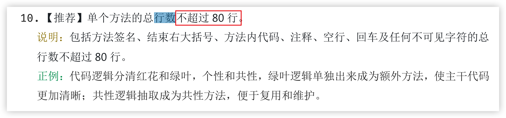
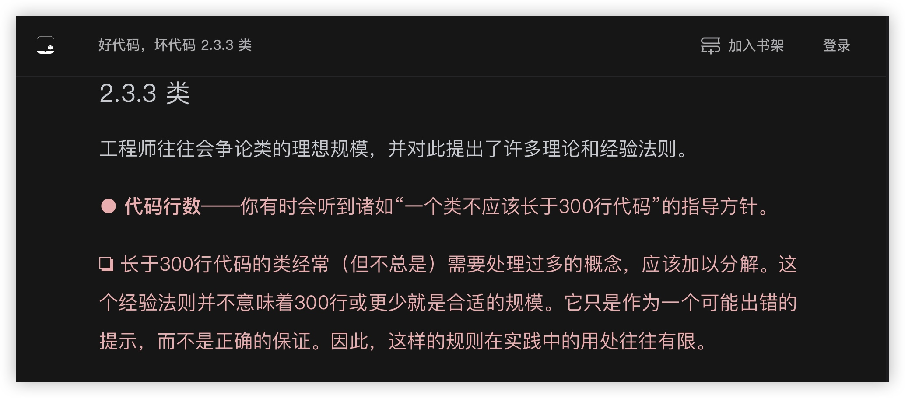
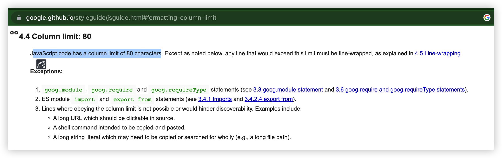

# 代码规范


# 讨论背景

相信大家写代码时 对自己都有一些要求，比如下面的

- 基本期望：写出他人能容易看懂的代码
- 更高追求：写出他人看起来很爽的代码

每经历一个阶段，大家都对编码有不同程度的进步提升，可以分享；同时也会积累一些场景下代码如屎的烦恼，想要破局。  

于是，阶段性的，需要一个机会，大家开个交流会进行讨论
- （对于每个个体）互通有无，集思广益，团队每人都有所提升
- （对于互相之间协作）更多地了解到彼此 阅读代码、写代码的风格习惯，增进理解
- （对于工作）对现阶段遇到的痛点，找出更优解，或制定调研计划

每次讨论，规范条款上的收获，不在于多少，至少会收获了一些代码细节上的技巧或认知，最重要的是 大大增进了互相的了解，协作起来将越来越紧密顺畅。


# 讨论成果

## 组件代码结构

关键点: 打开文件后，更方便的看到核心代码（那就尽量靠前咯）
> 也就是 render/return组件 之前的代码量尽可能少；那么，就需要通过函数提炼、划分职责等方式转移到别处。

组件代码 书写顺序 示例如下

```
// AAView.js

import { xxCalculate, xxUploadEvent } from 'app/components/XxModule'
import AView from './components/AView'
import BView from './components/BView'

//$$ 用于组件函数内的变量 紧邻写在组件函数上方
const variableUsedInXXComp = ...

//组件函数
const AAView = props => {

  //$$ props解构, 放第一行
  ///reason：即使AAView上面不写@param注释，通过这里的解构也能看出props的参数
  const { paramA, paramB } = props

  //$$ 副作用函数(即use开头的函数)，写在顶层作用域，
  const [aEverClicked, setAEverClicked] = useState(false)
  const [bClickedTime, setBClickedTime] = useState(0)
  ...

  //$$ 归类逻辑代码到hooks，e.g. 数据处理（获取数据、更新数据）聚合到一个hooks， 滑动相关监听处理 聚合到另一个hooks
  const {loading, data, error, addData, updateData} = useLoadData({id: paramA})
  ...

  //$$ 业务逻辑处理。 注意：如果这部分代码较多，一般是可以转移几个api，挪到 某单一职责的hooks里去
  const onPressAView = () => {
    //如果复杂逻辑(多行 e.g. 15行)，抽取纯函数， 与XXComp并列 放其后面
    addData( calculateAndCreateItemData(inputX, bClickedTime) )

    setAEverClicked(true)
    xxUploadEvent()
  }

  const onPressBView = () => {
    //简单逻辑(e.g. <10行)，直接写在这里
    updateData({ count: bClickedTime, key: variableUsedInXXComp })
    ...
    setBClickedTime(bClickedTime+1)
  }

  ...
  ...

  //$$ render
  return (
    <View style={styles.container}>
      <AView onPress={onPressAView}>
        {aEverClicked ? <View> ... </View> : null }
        ...
      </AView>
      <BView param={inputY} onPress={onPressBView}>
        ...
      </BView>
      ...
      {
        data?.map(item => (<View style={styles.content}}>
          <Text style={styles.title}>{styles.title}</Text>
          <Image style={styles.cover} source={data[0].cover} />
        </View>))
      }
    </View>
  )

}

//$$ hooks 数据获取相关逻辑：请求、loading状态、错误、数据处理(response data -> UI data)
const useLoadData = ({id}) => {
  const [data, setData] = useState(null)
  const [loading, setLoading] = useState(false)
	const [error, setError] = useState(null)

	useEffect(()=>{
		request({id}).then(res=>{
			setData(res.data)
		});
	}, [])
	//请求
	return {
	    data,
	    loading,
	    error
	    ...
	}
}

//$$ 仅用于组件内部的函数 紧邻写在组件函数下方
const calculateAndCreateItemData = (a, b) => {
  let result = {}
  //复杂逻辑
  ...
  ...
  result.count = xxCalculate(a, ...)
  return result
}
// 方法提炼到这里 reason：
// 1.提炼纯函数，略利于性能
// 2.移到这里，减少对核心代码的干扰


//$$ 仅用于样式的变量 紧邻写在styles声明的上方
const listWidth = px2dp(100)

const styles = StyleSheet.create({
  container: {
    //约束自身
    flex: 1,
    backgroundColor: '#eee',
    marginTop: px2dp(20),
    //约束子视图的
    paddingHorizontal: px2dp(15),
    flexDirection: "row",
    alignItems: "center",
    justifyContent: "space-between",
  },

  list: {
    marginHorizontal: 10,
    width: listWidth,
    ...
  },
  ...

})
```

## 较复杂模块拆分后的目录结构

> 目录 体现着模块划分思维

取项目里的一个典型示例

```
> tree ./app/screens/graphic/tabs/userHome/   

./app/screens/graphic/tabs/userHome/
├── components
│   ├── Header
│   │   ├── BackgroundImage.js
│   │   ├── MoreButton.js
│   │   ├── OpaqueNavBar.js
│   │   ├── index.js
│   │   └── useHeader.js
│   ├── LoadingView.js
│   ├── Tabbar.js
│   ├── TabsStickScrollView.js
│   └── list
│       ├── HistoryWorkList.js
│       ├── LikedWorkList.js
│       ├── MineWorkList.js
│       ├── UserWorkList.js
│       └── item
│           ├── UnpublishedEntryItem.js
│           ├── UnpublishedType.js
│           └── index.js
├── index.js
├── otherScreens
│   ├── DraftScreen.js
│   └── RejectScreen.js
└── utils
    └── DraftDataManager.js

```

> 合理拆分模块，避免单文件代码行数过多，统一命名风格，将大大减少理解阻碍

## 通知命名

以后会出这样一个 通知名 集中存放的文件

```
//NotificationCenter.js

export {
  listen,
  emit,
}

// 参考 iOS通知命名，UIKeyboardWillChangeFrameNotification，
// 命名表达出 who did (/will do) what，（即将）谁做了什么

//画本（某作品）点赞状态改变
export const kGraphicLikeStatusChangeNotification = 'kGraphicLikeStatusChangeNotification';

/* 使用示例
import { emit, kGraphicLikeStatusChangeNotification } from 'app/.../NotificationCenter';
emit(kGraphicLikeStatusChangeNotification, { graphicId: 123, likeStatus: 1 });

import { listen, kGraphicLikeStatusChangeNotification } from 'app/.../NotificationCenter';
const listener = listen(kGraphicLikeStatusChangeNotification, (data) => {
  ...
}
listener.remove();
 */

```

## 单个函数的总行数 限制多大合适？

- 《阿里巴巴 Java 开发手册 v1.4.0（详尽版）》 ：80 行

https://edu.aliyun.com/article/103 

若结合到咱公司自己项目， `<>` 与 `</>`、`{` 与 `}` 等标签的开始、结束（作用域）内尽量不超过 80 行

> 示例中的组件函数`AAView`比较特殊，其本身可能超 100 行，甚至更多 也没问题。因为其内部包含多个子函数、子组件；`AAView`内部的子函数、子组件`<View></View>`等可以参考 80 行限制

- 《代码不朽》：15 行

> https://www.zhihu.com/question/280041384/answer/468623926


- 为什么编程应遵循 “30” 规则

> https://www.infoq.cn/article/uu6zgvebe9w1ab1yqilb

《代码大全》Steve McConnell 指出，理论上，一个方法或函数的最佳最大限制是在一个屏幕上可以容纳的行数。

## 单个文件代码行数 限制多大合适？

核心点

- 维护成本：长而冗长的代码通常更难以理解、调试和维护。通过设置代码行数限制，可以鼓励开发者编写更简洁、模块化的代码，从而减少维护成本。

ChatGPT 的看法  


掘金文章 看法

- <https://juejin.cn/s/一个文件代码行数不超过多少> 300~500

- <https://juejin.cn/s/一个文件代码行数不超过多少行%20华为> 200

其它看法

- 【生理上】人的记忆只有三屏，80 行预计在两屏至两屏半之间。
- 【原则上】主干逻辑清晰，简洁易读
- 【要纯】初期代码多烂其实问题都不大的, 只要你函数全都是纯的, 以后化简还是拆起来都不是问题.
- 按照《重构》去做了，就不会出现单文件代码行数多的问题了
- 《好代码，坏代码》  
  

## 单行代码 字符串宽度/数量限制

上面提到的**文件代码行数**、**函数代码行数**在各大公司标准中 基本没有指明，但**代码列数限制**到是不少标准里 提到。

谷歌的[Google JavaScript Style Guide](https://google.github.io/styleguide/jsguide.html#formatting-column-limit) 80



## 其它

### 市面上 大而全的 JavaScript 规范

- [Airbnb JavaScript Style Guide](https://airbnb.io/javascript/react/#basic-rules)
- [Google JavaScript Style Guide](https://google.github.io/styleguide/jsguide.html)
- [Standard JavaScript](https://standardjs.com/)

### 代码规范的常用工具

eslint prettier

