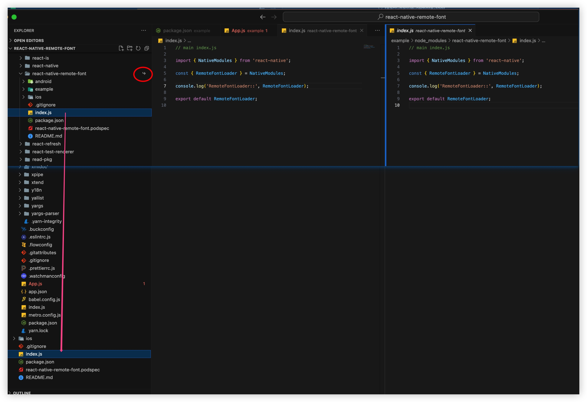
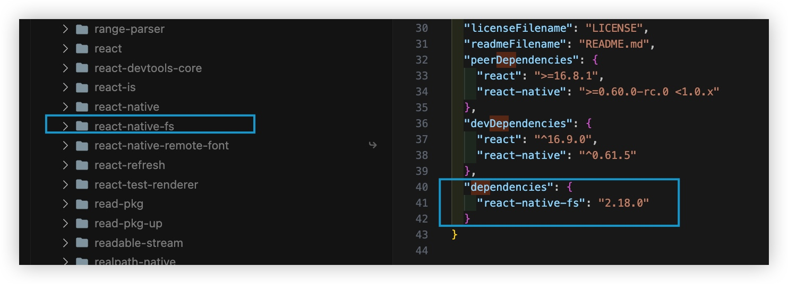

# 用脚手架 制作一个RN库 放npm


脚手架 [create-react-native-module](https://github.com/brodybits/create-react-native-module?tab=readme-ov-file)


## 脚手架使用（**顺利**）

* 工具安装
```
npm install -g yarn
npm install -g create-react-native-module
```

* 脚手架命令
```
create-react-native-module RemoteFont --object-class-name react-native-remote-font --object-class-name RemoteFontLoader --native-package-id com.yestin.font --platforms ios,android --github-account zyestin --author-name yestin --author-email zyestin@gmail.com --generate-example --example-react-native-template react-native@0.62
```

过程中发现，若不指定`--example-react-native-template react-native@0.62`，发现总有这样的报错日志
```
pod --version failure, aborting with broken example app
Error while creating library module react-native-remote-font
Error: Command failed with ENOENT: pod --version
spawnSync pod ENOENT
    at Object.spawnSync (internal/child_process.js:1077:20)
    at Object.spawnSync (child_process.js:776:24)
    at Function.module.exports.sync (/usr/local/lib/node_modules/create-react-native-module/node_modules/execa/index.js:174:25)
    at module.exports.commandSync (/usr/local/lib/node_modules/create-react-native-module/node_modules/execa/index.js:235:15)
    at /usr/local/lib/node_modules/create-react-native-module/lib/lib.js:265:17
    at new Promise (<anonymous>)
    at /usr/local/lib/node_modules/create-react-native-module/lib/lib.js:223:18
```

成功的日志
```
CREATE new React Native module with the following options:

                        name: RemoteFont
           full package name: react-native-remote-font
                     is view: false
           object class name: RemoteFontLoader
     Android nativePackageId: com.yestin.font
                   platforms: ios,android
           Apple tvosEnabled: false
                  authorName: yestin
                 authorEmail: zyestin@gmail.com
        author githubAccount: zyestin
                     license: MIT
          useAppleNetworking: false

             generateExample: true
          exampleFileLinkage: false
                 exampleName: example
  exampleReactNativeTemplate: react-native@0.62
         writeExamplePodfile: false

CREATE: Check for valid Yarn CLI tool version, as needed to generate the example project
1.22.21
yarn --version ok
CREATE: Generating the React Native library module
CREATE example app with the following template: react-native@0.62
                                                          
               ######                ######               
             ###     ####        ####     ###             
            ##          ###    ###          ##            
            ##             ####             ##            
            ##             ####             ##            
            ##           ##    ##           ##            
            ##         ###      ###         ##            
             ##  ########################  ##             
          ######    ###            ###    ######          
      ###     ##    ##              ##    ##     ###      
   ###         ## ###      ####      ### ##         ###   
  ##           ####      ########      ####           ##  
 ##             ###     ##########     ###             ## 
  ##           ####      ########      ####           ##  
   ###         ## ###      ####      ### ##         ###   
      ###     ##    ##              ##    ##     ###      
          ######    ###            ###    ######          
             ##  ########################  ##             
            ##         ###      ###         ##            
            ##           ##    ##           ##            
            ##             ####             ##            
            ##             ####             ##            
            ##          ###    ###          ##            
             ###     ####        ####     ###             
               ######                ######               
                                                          

                  Welcome to React Native!                
                 Learn once, write anywhere               

✔ Downloading template
✔ Copying template
✔ Processing template
✔ Installing CocoaPods dependencies (this may take a few minutes)

  
  Run instructions for Android:
    • Have an Android emulator running (quickest way to get started), or a device connected.
    • cd "/Users/yestin/Desktop/code_test/react-native/react-native-remote-font/example" && npx react-native run-android
  
  Run instructions for iOS:
    • cd "/Users/yestin/Desktop/code_test/react-native/react-native-remote-font/example" && npx react-native run-ios
    - or -
    • Open example/ios/example.xcworkspace in Xcode or run "xed -b ios"
    • Hit the Run button
    
  Run instructions for macOS:
    • See https://aka.ms/ReactNativeGuideMacOS for the latest up-to-date instructions.
    
  
Linking the new module library to the example app
yarn add v1.22.21
[1/4] 🔍  Resolving packages...
[2/4] 🚚  Fetching packages...
[3/4] 🔗  Linking dependencies...
warning "@react-native-community/eslint-config > @typescript-eslint/eslint-plugin@1.13.0" has incorrect peer dependency "eslint@^5.0.0".
warning "@react-native-community/eslint-config > @typescript-eslint/parser@1.13.0" has incorrect peer dependency "eslint@^5.0.0".
warning "@react-native-community/eslint-config > eslint-plugin-react@7.12.4" has incorrect peer dependency "eslint@^3.0.0 || ^4.0.0 || ^5.0.0".
warning "@react-native-community/eslint-config > eslint-plugin-react-native@3.6.0" has incorrect peer dependency "eslint@^3.17.0 || ^4 || ^5".
warning "@react-native-community/eslint-config > @typescript-eslint/eslint-plugin > tsutils@3.21.0" has unmet peer dependency "typescript@>=2.8.0 || >= 3.2.0-dev || >= 3.3.0-dev || >= 3.4.0-dev || >= 3.5.0-dev || >= 3.6.0-dev || >= 3.6.0-beta || >= 3.7.0-dev || >= 3.7.0-beta".
[4/4] 🔨  Building fresh packages...
success Saved lockfile.
success Saved 1 new dependency.
info Direct dependencies
└─ react-native-remote-font@0.0.0
info All dependencies
└─ react-native-remote-font@0.0.0
✨  Done in 2.18s.
check for valid pod version in /Users/yestin/Desktop/code_test/react-native/react-native-remote-font/example/ios
Ignoring ffi-1.15.5 because its extensions are not built. Try: gem pristine ffi --version 1.15.5
Ignoring json-2.6.2 because its extensions are not built. Try: gem pristine json --version 2.6.2
1.11.3
running pod install in /Users/yestin/Desktop/code_test/react-native/react-native-remote-font/example/ios
Ignoring ffi-1.15.5 because its extensions are not built. Try: gem pristine ffi --version 1.15.5
Ignoring json-2.6.2 because its extensions are not built. Try: gem pristine json --version 2.6.2
Auto-linking React Native module for target `example`: react-native-remote-font
Analyzing dependencies
Downloading dependencies
Installing react-native-remote-font (1.0.0)
Generating Pods project
Integrating client project
Pod installation complete! There are 48 dependencies from the Podfile and 38 total pods installed.

[!] Your project does not explicitly specify the CocoaPods master specs repo. Since CDN is now used as the default, you may safely remove it from your repos directory via `pod repo remove master`. To suppress this warning please add `warn_for_unused_master_specs_repo => false` to your Podfile.

📚  Created library module react-native-remote-font in `./react-native-remote-font`.
🕘  It took 234511ms.

====================================================
YOU'RE ALL SET!

💡 check out the example app in react-native-remote-font/example
💡 recommended: run Metro Bundler in a new shell
ℹ (cd react-native-remote-font/example && yarn start)
💡 enter the following commands to run the example app:
ℹ cd react-native-remote-font/example
ℹ yarn ios # for React Native 0.60: npx react-native run-ios
ℹ yarn android # for React Native 0.60: npx react-native run-android
⚠ IMPORTANT NOTICES
⚠ After clean checkout, these first steps are needed:
ℹ run Yarn in react-native-remote-font/example/ios
ℹ (cd react-native-remote-font/example && yarn)
ℹ do `pod install` for iOS in react-native-remote-font/example/ios
ℹ cd react-native-remote-font/example
ℹ (cd ios && pod install)
⚠ KNOWN ISSUE with adding dependencies to the library root
ℹ see https://github.com/brodybits/create-react-native-module/issues/308
```

* 目录结构
```
ll -alh react-native-remote-font                                                                                                    14:29:53

total 40
.
..
.gitignore
README.md
android
example
index.js
ios
package.json
react-native-remote-font.podspec
```

android目录
```
tree react-native-remote-font/android                                                                                               11:32:42
react-native-remote-font/android
├── README.md
├── build.gradle
└── src
    └── main
        ├── AndroidManifest.xml
        └── java
            └── com
                └── yestin
                    └── font
                        ├── RemoteFontLoaderModule.java
                        └── RemoteFontLoaderPackage.java
```

ios目录
```
tree react-native-remote-font/ios                                                                                                   11:38:56
react-native-remote-font/ios
├── RemoteFontLoader.h
├── RemoteFontLoader.m
├── RemoteFontLoader.xcodeproj
│   └── project.pbxproj
└── RemoteFontLoader.xcworkspace
    └── contents.xcworkspacedata
```


## 运行iOS（**较顺利**）

如RN0.62老样子，App成功启动了，  
但弹窗报错``React Native: Unexpected token ':'. Expected a ')'``  

这样改`metro-react-native-babel-preset from 0.58.0 to 0.59.0`

然后`yarn install && npx pod-install` 后，  
重新`Xcode run iOS`就OK了


## 将自定义三方库代码写入（**有坑**）

### 输入 本库代码
直接在顶层目录 改三方库代码就行

> 因为`example`内所使用的`react-native-remote-font`文件，是软链，指向到顶层目录的
> 


### 添加 其它依赖库（**挺坑**）

直接在`package.json`里添加如上依赖后，`yarn && npx pod-install`后，Xcode run 报错如下，多次这样后，还是报错。。。
```
error: Error: Unable to resolve module react-native-fs from /Users/yestin/Desktop/code_test/react-native/react-native-remote-font/index.js: react-native-fs could not be found within the project or in these directories:
  /Users/yestin/Desktop/code_test/react-native/react-native-remote-font/example/node_modules

If you are sure the module exists, try these steps:
 1. Clear watchman watches: watchman watch-del-all
 2. Delete node_modules and run yarn install
 3. Reset Metro's cache: yarn start --reset-cache
 4. Remove the cache: rm -rf /tmp/metro-*
  10 | } from "react-native";
  11 | import React, { useEffect, useMemo, useRef, useState } from "react";
> 12 | import RNFS from "react-native-fs";
     |                   ^
```

按照上面的提示，执行
```
watchman watch-del-all  
rm -rf node_modules 
yarn && npx pod-install
```

也终于在 node_modules下 能看到了 `react-native-fs`


此时，居然还没有好，报错
```
Invariant Violation: Native module cannot be null
```

因Xcode 并没有link到这个库的iOS代码`RNFS`，Xcode里完全搜不到

于是 往`example/ios/Podfile`里手动添加link
```
pod 'RNFS', :path => '../node_modules/react-native-fs'
```
再`npx pod-install`后 就好了

> 我把这个临时方案提供到了[create-react-native-module/issues/489#](https://github.com/brodybits/create-react-native-module/issues/489#issuecomment-1855452220)


## 写Demo测试

从 [Google Fonts](https://fonts.google.com/specimen/Ma+Shan+Zheng) 扒一些字体链接
```
const fontInfoList = [
  {
    fontName: "Ma Shan Zheng",
    fontUrl: "https://fonts.gstatic.com/s/mashanzheng/v10/NaPecZTRCLxvwo41b4gvzkXaRMHsCoRTJKKTqxFXqIji1hn3wSpSEA3eSpJy0awdsFt2Zfc6SSE.119.woff2",
  },
  {
    fontName: "Afacad",
    fontUrl: "https://fonts.gstatic.com/s/afacad/v1/6NUI8FKMIQOGaw6ahLYEvBjUVG5Ga92uVSQ-9kKlZfNfuw.ttf",
  },
  {
    fontName: "Rubik Bubbles",
    fontUrl:
      "https://fonts.gstatic.com/s/rubikbubbles/v3/JIA1UVdwbHFJtwA7Us1BPFbRNTENfDxyRXI.ttf",
  },
  {
    fontName: "Preahvihear",
    fontUrl: "https://fonts.gstatic.com/s/preahvihear/v29/6NUS8F-dNQeEYhzj7uluxswE49FJf8Wv.ttf",
  },
];
```

测试的核心代码
```
  <ArtText
    text="Hello World"
    style={{ fontSize: 20, fontVariant: ["proportional-nums"] }}
    fontInfo={fontInfoList[fontInfoIndex]}
  />

```

--------

同样，将安卓代码放进去

## 运行 Android（**挺坑**）

yarn android报错

### (1) `Failed to transform react-native-0.71.0-rc.0-debug.aar`

```
* What went wrong:
Execution failed for task ':react-native-remote-font:javaPreCompileDebug'.
> Could not resolve all files for configuration ':react-native-remote-font:debugCompileClasspath'.
   > Failed to transform react-native-0.71.0-rc.0-debug.aar (com.facebook.react:react-native:0.71.0-rc.0) to match attributes {artifactType=android-classes, com.android.build.api.attributes.BuildTypeAttr=debug, org.gradle.category=library, org.gradle.dependency.bundling=external, org.gradle.libraryelements=aar, org.gradle.status=release, org.gradle.usage=java-api}.
      > Execution failed for JetifyTransform: /Users/yestin/.gradle/caches/modules-2/files-2.1/com.facebook.react/react-native/0.71.0-rc.0/7a7f5a0af6ebd8eb94f7e5f7495e9d9684b4f543/react-native-0.71.0-rc.0-debug.aar.
         > Java heap space
```

查到是RN的原因了，照着这个回答 [react-native/issues/35210#issuecomment-1304536693](https://github.com/facebook/react-native/issues/35210#issuecomment-1304536693)

在`react-native-remote-font/example/android/build.gradle`添加如下代码
```
def REACT_NATIVE_VERSION = new File(['node', '--print',"JSON.parse(require('fs').readFileSync(require.resolve('react-native/package.json'), 'utf-8')).version"].execute(null, rootDir).text.trim())

allprojects {
    configurations.all {
        resolutionStrategy {
            // Remove this override in 0.66, as a proper fix is included in react-native itself.
            force "com.facebook.react:react-native:" + REACT_NATIVE_VERSION
        }
    }
```
再次 `yarn android` App成功安装启动，但依然报错


### (2) 也遇到 Link问题

* build error 找不到符号`RNFSPackage`

```
/Users/yestin/Desktop/code_test/react-native/react-native-remote-font/example/android/app/src/main/java/com/example/MainApplication.java:31: 错误: 找不到符号
            packages.add(new RNFSPackage());
                             ^
  符号: 类 RNFSPackage

* What went wrong:
Execution failed for task ':app:compileDebugJavaWithJavac'.
> Compilation failed; see the compiler error output for details.
```

在`build.gradle`的`dependencies {...}`内添加
```
    implementation project(':react-native-fs')
```


* build error `':react-native-fs' could not be found in project ':app'`

```
FAILURE: Build failed with an exception.

* Where:
Build file '/Users/yestin/Desktop/code_test/react-native/react-native-remote-font/example/android/app/build.gradle' line: 197

* What went wrong:
A problem occurred evaluating project ':app'.
> Project with path ':react-native-fs' could not be found in project ':app'.
```

在`settings.gradle` 添加 path
```
include ':react-native-fs'
project(':react-native-fs').projectDir = new File(rootProject.projectDir, '../node_modules/react-native-fs/android')
```

运行成功了，但弹窗报错

* build error `TypeError: null ... RNFSManager`

```
TypeError: null is not an object (evaluating 'RNFSManager.RNFSFileTypeRegular')
```
发现搜不到`RNFSManager`被引用的地方

于是在`MainApplication.java`中`getPackages(){...}`内添加
```
// react-native-fs
import com.rnfs.RNFSPackage;

packages.add(new RNFSPackage());
```

至此，终于 不报错了。。。


## 发布

* 确认本地是否成功登陆npm认证成功
```
npm whoami

zyestin
```
> 若未登录，则执行`npm adduser`


* 执行`npm publish`

报错，是因为我刚删除了同名库，想重发一个，却失败了。  
而npm规则是 24小时才能发布刚删除的同名的包
```
18 http fetch PUT 403 https://registry.npmjs.org/react-native-remote-font 1544ms
19 verbose stack Error: 403 Forbidden - PUT https://registry.npmjs.org/react-native-remote-font - react-native-remote-font cannot be republished until 24 hours have passed.
```


