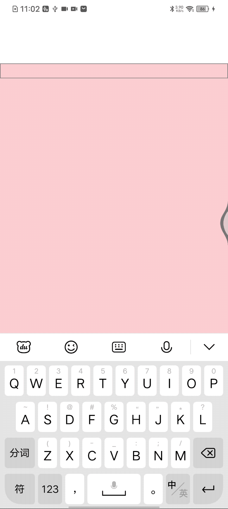

# 模仿抖音、小红书 输入 #标签 高亮


## 需求

当输入 以#开头的字符串，则判定为标签 并展示为蓝色

效果图


## 调研
iOS的TextField可以设定attributedString富文本，但RN的TextInput是不具备的。

**方案**：  
TextInput上浮一个style大小一致的Text，TextInput文字颜色设为透明，Text内嵌套 style为蓝色的Text 用来展示`#任意(至少1个)字符`


## 代码
```javascript
import React, { useState } from "react";
import { View, TextInput, Text, StyleSheet } from "react-native";

const App = () => {
  const [text, setText] = useState("");

  const handleTextChange = (inputText) => {
    // 检测输入字符串中是否包含 "#"
    if (inputText.includes("#")) {
      // 将包含 "#任意(至少1个)字符" 的部分替换为带有蓝色样式的文本组件
      const parts = inputText.split(/(?=#|\s)/g);
      console.log("parts: ", parts);
      const formattedText = parts.map((part, index) => {
        return part.includes("#") && part.length >= 1 ? (
          <Text
            onPress={() => {
              console.log("click part:", part);
            }}
            key={index}
            style={{ color: "blue" }}
          >
            {part}
          </Text>
        ) : (
          part
        );
      });

      // 设置更新后的文本
      setText(formattedText);
    } else {
      // 输入字符串不包含 "#文字"，直接设置文本
      setText(inputText);
    }
  };

  return (
    <View style={{ flex: 1, backgroundColor: "pink", marginTop: 100 }}>
      <TextInput
        style={[
          styles.text,
          {
            borderWidth: 1,
            borderColor: "gray",
            width: "100%",
            padding: 0,
            color: "white",
          },
        ]}
        onChangeText={handleTextChange}
        multiline={true}
      >
        <Text>{text}</Text>
      </TextInput>

      <Text style={{ color: "yellow" }}>{text}</Text>
    </View>
  );
};

const styles = StyleSheet.create({
  container: {
    backgroundColor: "#fff",
    borderWidth: 1,
    borderColor: "gray",
    padding: 10,
    marginTop: 20,
  },
  text: {
    color: "white",
    fontSize: 16,
    lineHeight: 20,
  },
});

export default App;

```

代码核心逻辑：  
输入文字变化后，将文字按照 **`#文本`**，分割为数组，结果如下日志所示。 然后对每个元素 判断是否含`#`，含有 则设定`blue`样式

日志：  
```
 LOG  parts:  ["好的", "#记得记", " 记得记得", "#记得记得", " ", "#记得记得", " "]

```


