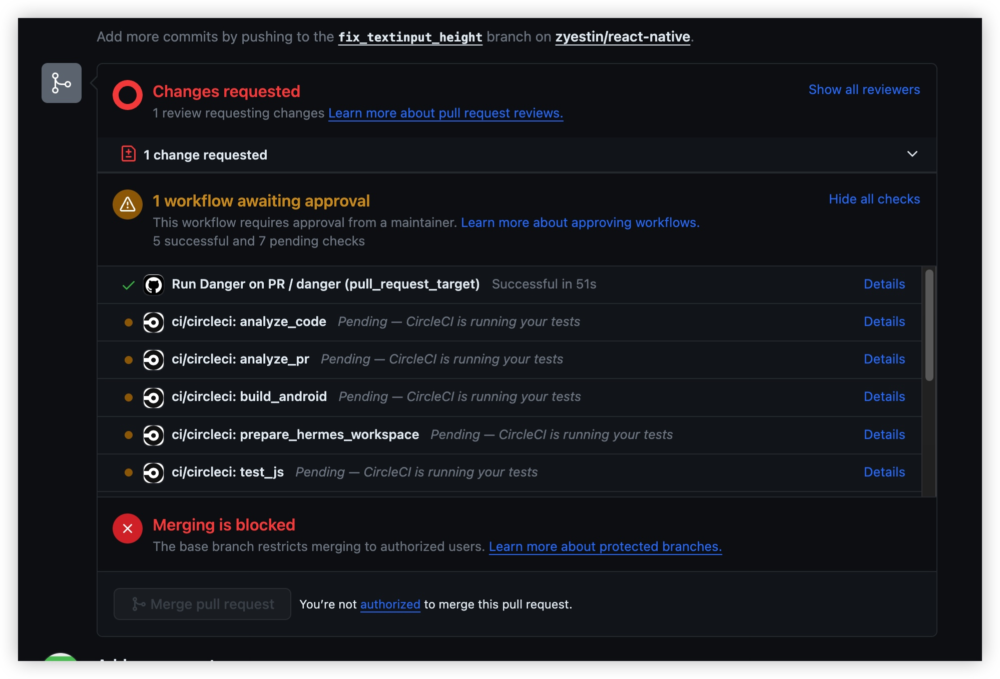

# 第一次提交PR给react-native


用了3年RN了，第一次给RN提交PR，有点激动，值得记录呀！

## 操作记录

git操作全在github完成


* **<u>2023.12.05 7:52PM</u>** 提交


`fork` -> 创建分支 -> 改代码 -> 提交


然后进入`pull request` tab ，就能看到`Compare & pull request`入口，点击它

> 生成的PR地址：
https://github.com/facebook/react-native/pull/41803

然后就进入 PR描述编辑区，按提示编辑完，提交即可

首次提交PR，提示需要签署CLA


跳转到这里
https://github.com/facebook/react-native/pull/41803/checks?check_run_id=19326140445

再打开  https://code.facebook.com/cla， 进行签署CLA


签署后，这个页面就进入一个无法编辑的状态，虽然顶部有提示，如果在签CLA之前已经提交了一个，再耐心等待会，会自动处理的

> 👉🏻[这个友人的经历是很好的借鉴](https://juejin.cn/post/7056792726104178702)

于是，从21:49，等啊等，到了 23:54，才有反馈


第二天早上一看 10:13，还给了我建议，我点击一下 `Commit suggestion`就ok了


最后就差`maintainer`批准了


> 一般多久批准呢？
> 浏览了2个merged的PR，都是2天

---------

* **<u>2023.12.13 11:24PM</u>** 终于收到邮件 PR被合并
```
This pull request was successfully merged by @zyestin in 5217cc9.
```

* 并且紧接着收到邮件 PR被关闭
```
Closed #41803 via 5217cc9.
```


> 那何时 带有我贡献的代码 会被发布呢？  
> 等待下一个版本被推出的时候咯

--------

待续~

