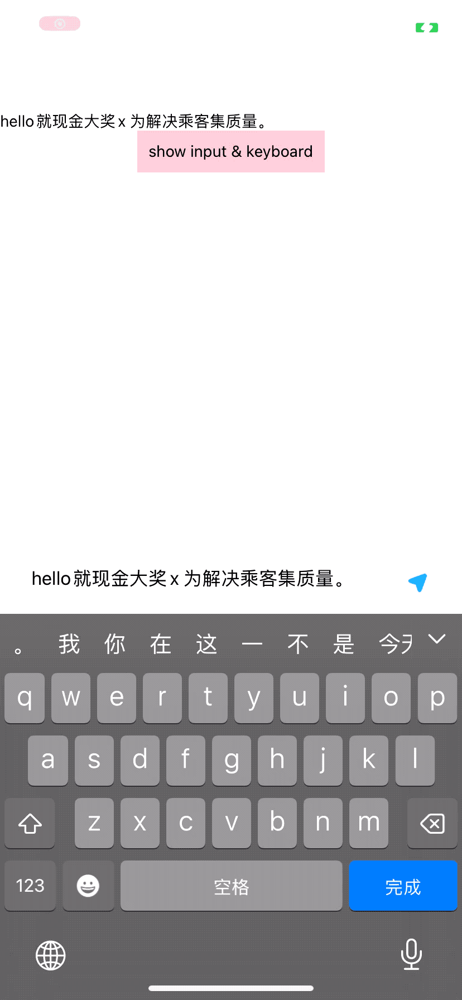

# 封装 低耦合、易用的文本输入框弹窗


## 效果展示/UI
* 切换输入法，避开键盘
* 输入/粘帖时，文字换行，输入框高度准确变化




## 使用/Usage
封装后，如下这样使用，解耦的干干净净
```
import TextInputAlert from "./TextInputAlert";

TextInputAlert.show({
      text: "hello",
      // maxLength: 20,
      onChange: function didInputChange(text_) {
        console.log("didInputChange::>>", text_);
      },
      onCompleted: () => {
        console.log("onCompleted::>>", content);
      },
    });
    
TextInputAlert.hide();

```
像原生一样调api方式展示弹窗，不需要`Modal`那样耦合过多（视图嵌入、visible字段控制...）

## 源码/Code

[TextInputAlert](media/17013388535968/TextInputAlert.js)


